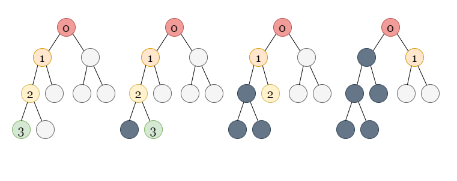

# Solution

---

## Overview

We are given the root node of a binary tree.

Our task is to find the longest zigzag path contained in the tree.

---

## Approach: Depth First Search
### Intuition

We can see that there are only two options available from each parent node. We either go to its left or right child (if they exist).

Let us observe some situations in which we move from a parent node to its children.

Consider a parent node p, which itself is a left child. If p has a left child, l, we cannot combine the edges going into p and l, because they have the same direction and do not form a zigzag path. We can only begin a new zigzag path of length 1 by including the edge between p and l.

If p has a right child, r, we can include the edges going into p and r together because their directions are opposite and form a zigzag path. If we know the length of the zigzag path until node p, including r increases the length of the path by 1.

Now assume, that node p itself is a right child. If it has a left child l, we can combine the edges going into p and l. The length of the zigzag path until l is equal to the length of the zigzag path until p plus 1. If p has a right child, r, we must start over with only the edge between p and r forming a zigzag path of length 1.

This provides us with a solution to the problem. All we have to do now is keep track of which way we should go to continue forming a zigzag path. Depending on the current direction, we either include the edge of the child in the zigzag path that includes the edge going into the parent node, or we start a new zigzag path with the edge going into the child if the current direction does not match the direction of the child node.

We can use a graph traversal algorithm like depth-first search (DFS) to traverse in the tree. In DFS, we use a recursive function to explore nodes as far as possible along each branch. Upon reaching the end of a branch, we backtrack to the previous node and continue exploring the next branches.



If you are new to Depth First Search, please see our Leetcode Explore Card for more information on it!

To store the longest zigzag path found thus far, we define an answer variable pathLength = 0. We implement a dfs method that accepts a TreeNode node, a boolean goLeft to indicate whether we should go left for the continuation of the zigzag path, and steps which stores the length of the zigzag path so far.

It's worth noting that we can substitute any other indication for goLeft. We can use whether the parent node is a left or right child, or we can choose whether to continue the zigzag path to the right (similar to left).

In the dfs method, we first determine whether node is null or not. If node is null, we exit the method. If it is a valid node, we update our answer variable pathLength = max(pathLength, steps).

If goLeft is true, the zigzag path will continue to the left. We can't go left in the next step to continue this zigzag path because we're already going left in this step. As a result, we call dfs(node.left, false, steps + 1). We passed steps + 1 because we kept going in a zigzag pattern.

It should be noted that if the left does not exit, this call will be returned while we check if node is null at the beginning. After the null node check, we update pathLength, so it should only update pathLength for valid nodes.

We use dfs(node.right, true, 1) for the right child. Because we must visit the left child the next time, we passed true for goLeft. We pass 1 forsteps to begin a new zigzag path including only the parent to the right child edge as it cannot be merged with ongoing path.

If goLeft is set to false, the zigzag path will continue to the right. We use dfs(node.left, false, 1) for the left child because we need to start a new zigzag path from the parent to the left child edge and we can't take left again in the next step. For the right child, we call dfs(node.right, true, steps + 1) because we keep continuing in the zigzag pattern.

### Algorithm

1. Create an integer variable pathLength to store the length of the longest zigzag path found discovered so far. Initialize it with 0.
2. Begin the DFS traveral. We implement the dfs method which takes three parameters: a TreeNode node from which the current traversal begins, a boolean goLeft to indicate whether we should go left now to continue the ongoing zigzag path, and an integer steps to store the length of the current zigzag path. We call dfs(root, false, 0) and dfs(root, true, 0) because we can take any direction from the root node and pass 0 for steps as there is no zigzag path formed yet:
    * If node == null, return.
    * If goLeft is true, we can continue on the zigzag path by going left. To move to the left child, we use dfs(node.left, false, steps + 1), marking goLeft as false for the next move and increasing steps by 1. We also traverse to the right child using dfs(node.right, true, 1) to begin a new zigzag path that only includes the edge leading to the right child as it cannot be merged with the ongoing path. We pass true for the next move as we moved in the right direction in this step.
    * Otherwise, if goLeft is false, we move to the left child by calling dfs(node.left, false, 1) and move to the right child by calling dfs(node.right, true, steps + 1).
3. Return pathLength.

### Implementation

Java

```Java
class Solution {
    int pathLength = 0;
    private void dfs(TreeNode node, boolean goLeft, int steps) {
        if (node == null) {
            return;
        }
        pathLength = Math.max(pathLength, steps);
        if (goLeft) {
            dfs(node.left, false, steps + 1);
            dfs(node.right, true, 1);
        } else {
            dfs(node.left, false, 1);
            dfs(node.right, true, steps + 1);
        }
    }

    public int longestZigZag(TreeNode root) {
        dfs(root, false, 0);
        dfs(root, true, 0);
        return pathLength;
    }
}
```

### Complexity Analysis

Here, n is the number of nodes in the given binary tree.

    Time complexity: O(n)
        Using the dfs function, we recursively visit both the childrens of every node once. As a result, it takes O(n) time because there are nnn nodes in total. We iterate over each edge once to visit all the all nodes, which again takes O(n) operations as there are n−1n - 1n−1 edges in the tree.

    Space complexity: O(n)
        The recursion stack used by dfs can have no more than nnn elements in the worst-case scenario where each node is added to it. It would take up O(n) space in that case.
        
