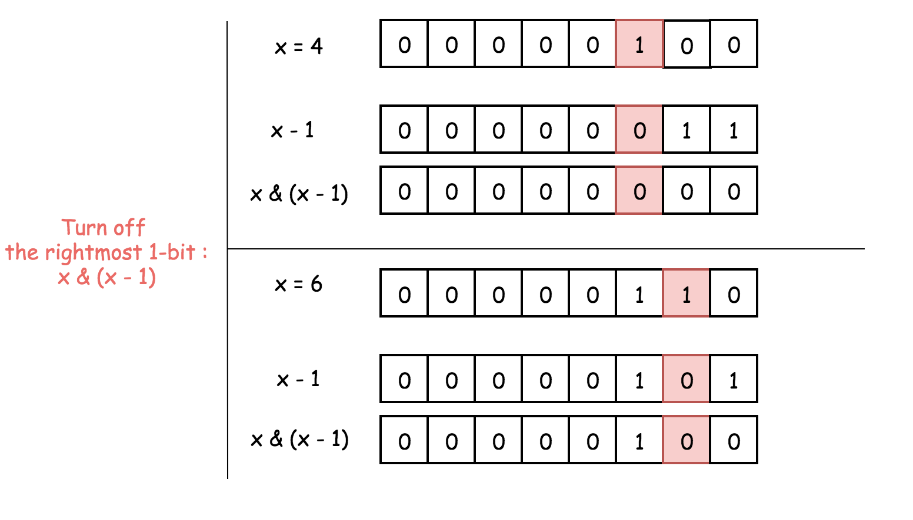
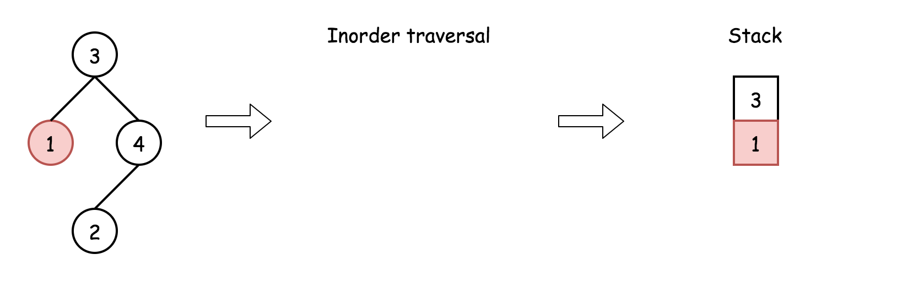

# Solution

---

## Overview

### Two subproblems

The problem consists of two subproblems:

* Traverse the tree to build all root-to-leaf paths.

* For each root-to-leaf path, check if it's a pseudo-palindromic path or not.


Figure 1. Two subproblems.

*How to traverse the tree to build all root-to-leaf paths*

There are three DFS ways to traverse the tree: preorder, postorder and inorder. Please check two minutes picture explanation if you don't remember them quite well: here is the Python version and [here is the Java version](https://leetcode.com/problems/binary-tree-inorder-traversal/discuss/328601/all-dfs-traversals-preorder-postorder-inorder-in-java-in-5-lines).


Figure 2. The nodes are enumerated in the order of visits. To compare different DFS strategies, follow 1-2-3-4-5 direction.

    Root-to-leaf traversal is so-called DFS preorder traversal. To implement it, one has to follow the straightforward strategy Root->Left->Right.

    There are three ways to implement preorder traversal: iterative, recursive, and Morris. Here we're going to implement the first two.

Iterative and recursive approaches here do the job in one pass, but they both need up to O(H) space to keep the stack, where HHH is a tree height.

How to check if the path is pseudo-palindromic or not

    It's quite evident that the path is pseudo-palindromic if it has at most one digit with an odd frequency.

How to check that?

The straightforward way is to save each root-to-leaf path into a list and then check each digit for parity.

Java

```Java
public boolean checkPalindrom(ArrayList<Integer> nums) {
    int isPalindrom = 0;

    for (int i = 1; i < 10; ++i) {
        if (Collections.frequency(nums, i) % 2 == 1) {
            ++isPalindrom;
            if (isPalindrom > 1) {
                return false;    
            }     
        }   
    }
    return true;    
}
```

This method requires keeping each root-to-leaf path, and that becomes space-consuming for the large trees. To save space, let's compute the parity on the fly using bitwise operators.

    The idea is to keep the frequency of digit 1 in the first bit, 2 in the second bit, etc: path ^= (1 << node.val).

[Left shift operator](https://leetcode.com/problems/pseudo-palindromic-paths-in-a-binary-tree/editorial/?source=submission-ac) is used to define the bit, and [XOR operator](https://leetcode.com/problems/single-number-ii/solution/) - to compute the digit frequency.


Figure 3. XOR of zero and a bit results in that bit. XOR of two equal bits (even if they are zeros) results in a zero. Hence, one could see the bit in a path only if it appears an odd number of times.

Java

```Java
// compute occurences of each digit 
// in the corresponding bit
path = path ^ (1 << node.val);
```

Now, to ensure that at most one digit has an odd frequency, one has to check that path is a [power of two](https://leetcode.com/problems/power-of-two/solution/), i.e., at most one bit is set to one. That could be done by turning off (= setting to 0) the rightmost 1-bit: path & (path - 1) == 0. You might want to check the article [Power of Two](https://leetcode.com/problems/power-of-two/solution/) for the detailed explanation of this bitwise trick.


Figure 4. x & (x - 1) is a way to set the rightmost 1-bit to zero, i.e., x & (x - 1) == 0 for the power of two. To subtract 1 means to change the rightmost 1-bit to 0 and to set all the lower bits to 1. Now AND operator: the rightmost 1-bit will be turned off because 1 & 0 = 0, and all the lower bits as well.

Java

```Java
// if it's a leaf, 
// check that at most one digit has an odd frequency
if ((path & (path - 1)) == 0) {
    ++count;
}
```

---

## Approach 1: Iterative Preorder Traversal.

### Intuition





Here we implement standard iterative preorder traversal with the stack:

* Initialize the counter to zero.

* Push root into the stack.

* While the stack is not empty:

    * Pop out a node from the stack and update the current number.

    * If the node is a leaf, update the root-to-leaf path, check it for being pseudo-palindromic, and update the count.

    * Push right and left child nodes into the stack.

* Return count.

### Implementation

Note, that [Javadocs recommends using ArrayDeque, and not Stack as a stack implementation](https://docs.oracle.com/javase/8/docs/api/java/util/ArrayDeque.html).

Java

```Java
class Solution {
    public int pseudoPalindromicPaths (TreeNode root) {
        int count = 0, path = 0;
        
        Deque<Pair<TreeNode, Integer>> stack = new ArrayDeque();
        stack.push(new Pair(root, 0));
        while (!stack.isEmpty()) {
            Pair<TreeNode, Integer> p = stack.pop();
            TreeNode node = p.getKey();
            path = p.getValue();

            if (node != null) {
                // compute occurrence of each digit 
                // in the corresponding register
                path = path ^ (1 << node.val);
                // if it's a leaf check if the path is pseudo-palindromic
                if (node.left == null && node.right == null) {
                    // check if at most one digit has an odd frequency
                    if ((path & (path - 1)) == 0) {
                        ++count;
                    }
                } else {
                    stack.push(new Pair(node.right, path));
                    stack.push(new Pair(node.left, path));
                }
            }
        }
        return count;
    }
}
```

### Complexity Analysis

    Time complexity: O(N) since one has to visit each node, where NNN is a number of nodes.

    Space complexity: up to O(H) to keep the stack, where HHH is a tree height.

---

## Approach 2: Recursive Preorder Traversal.

Iterative approach 1 could be converted into a recursive one.

Recursive preorder traversal is extremely simple: follow Root->Left->Right direction, i.e., do all the business with the node (i.e., update the current path and the counter), and then do the recursive calls for the left and right child nodes.

P.S. Here is the difference between preorder and the other DFS recursive traversals.


Figure 5. The nodes are enumerated in the order of visits. To compare different DFS strategies, follow 1-2-3-4-5 direction.

### Implementation

Java

```Java
class Solution {
    int count = 0;
        
    public void preorder(TreeNode node, int path) {
        if (node != null) {
            // compute occurences of each digit 
            // in the corresponding register
            path = path ^ (1 << node.val);
            // if it's a leaf check if the path is pseudo-palindromic
            if (node.left == null && node.right == null) {
                // check if at most one digit has an odd frequency
                if ((path & (path - 1)) == 0) {
                    ++count;
                }
            }
            preorder(node.left, path);
            preorder(node.right, path) ;
        }
    }

    public int pseudoPalindromicPaths (TreeNode root) {
        preorder(root, 0);
        return count;
    }
}
```

### Complexity Analysis

    Time complexity: O(N) since one has to visit each node, check if at most one digit has an odd frequency.

    Space complexity: up to O(H) to keep the recursion stack, where H is a tree height.

---

### Further Reading

The problem could be solved in constant space using the Morris inorder traversal algorithm, as it was done in [Sum Root-to-Leaf Numbers](https://leetcode.com/problems/sum-root-to-leaf-numbers/solution/). It is unlike that one can come up with a Morris Traversal solution during an interview, but it is worth knowing anyway.
