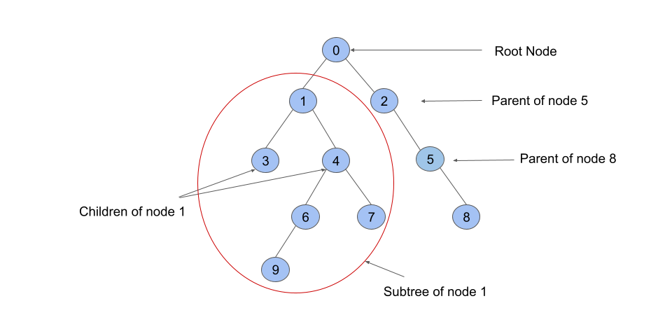
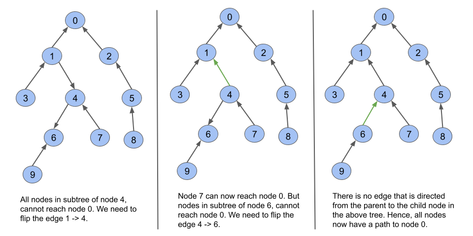

# 1466. Reorder Routes to Make All Paths Lead to the City Zero

## Solution
### Overview

We are given a tree with n nodes where each node is a city numbered from 0 to n - 1. The edges are referred to as roads between the cities.

The tree given in the problem has directed edges provided by connections.

We need to return the number of edges that need to be flipped so that from every node, you can somehow reach node 0, i.e., there is a path from every node to node 0.

Before moving on to the solution, consider some of the graph terminologies that will be used later:



1. **Child:** A node that is one edge further away from a given node in a rooted tree. In the above image, nodes 3, 4 are children of 1, which is called the parent. (When we consider 0 as the root)
2. **Descendants:** Descendants of a node are children, children of children, and so on. In the above image, nodes 3, 4, 6, 7, 9 are all descendants of 1.
3. **Subtree:** A subtree of a node T is a tree S consisting of a node T and all of its descendants in T. The subtree corresponding to the root node is the entire tree.

### Approach 1: Depth First Search
#### Intuition

Because we need to bring everyone to node 0, we can model the graph as a tree rooted at node 0 (the problem statement hints at this by stating that the network forms a tree structure). We can imagine that in order to move from any node to the root, all edges must be directed from a child to its parent. If there is an edge from a parent node to its child node, no node in the subtree of the child can reach the root node. This edge must be flipped.

Let's take a visual example to understand this.



So, our task is to count the number of edges in a tree rooted at node '0' that are directed from the parent node to a child node.

We must traverse the entire tree to determine the number of such edges that are directed from the parent to the child node. To traverse the tree, we can use a graph traversal algorithm such as depth-first search (DFS).

In DFS, we use a recursive function to explore nodes as far as possible along each branch. Upon reaching the end of a branch, we backtrack to the previous node and continue exploring the next branches.

Once we encounter an unvisited node, we will take one of its neighbor nodes (if exists) as the next node on this branch. Recursively call the function to take the next node as the 'starting node' and solve the subproblem.

If you are new to Depth First Search, please see our [Leetcode Explore Card](https://leetcode.com/explore/featured/card/graph/619/depth-first-search-in-graph/3882/) for more information on it!

The caveat is that our edges are directed. To count the number of edges that are directed from a parent to its child node, we must traverse the entire tree. If there is an edge from a child to its parent node, we will be unable to reach the child from the parent.

To traverse the entire tree, we must find a way to get from node 0 to all of the nodes in any case. This is possible if the edges are treated as undirected. We add an opposite edge from node b to node a for every given edge in connections from node a to node b. Let us refer to the edge we added as an "artificial" edge and the edge present in connections as an "original" edge.

If we use an "artificial" edge to move from the parent node to the child node, we know that the original edge is directed from the child node to the parent node. We don't need to flip the "original" edge.

If we use an "original" edge to move from the parent node to the child node, it means we need to flip this edge. Whenever we encounter such an edge, we will increment our answer variable by 1.

We can distinguish between an "original" and an "artificial" edge in many different ways (assigning booleans, specific numbers, etc.). In this article, we will associate an extra value with each edge - 1 for "original" edges and 0 for "artificial" edges.

We also set an answer variable count = 0 to count the number of edges that must be flipped. Now we start a DFS from node 0 and work our way down the tree (from parent to child). If we come across an "original" edge during the traversal, that is, an edge labeled with a 1, we increase the count by one. We don't modify count if we come across an "artificial" edge. We can combine these two operations and perform count += sign where sign is either 0 or 1 indicating an "artificial" or "original" edge.

We have our answer in count at the end of the traversal.
#### Algorithm

1. Create an integer variable count to count the number of edges that must be flipped. We initialize it with 0.
2. Create an adjacency list adj that contains a list of pairs of integers such that adj[node] contains all the neighbors of node in the form of (neighbor, sign) where neighbor is the neighboring node of node and sign denotes the direction of the edge i.e., whether its an "original" or "artificial" edge.
3. Start a DFS traversal.
    * We use a function dfs to perform the traversal. For each call, pass node, parent, adj as the parameters. We start with node 0 and parent as -1.
    * Iterate over all the neighbors of the node (nodes that share an edge) using adj[node]. For every neighbor, sign in adj[node], check if neighbor is equal to parent. If neighbor is equal to parent, we will not visit it again.
    * If neighbor is not equal to parent, we perform count += sign and recursively call the dfs with node = neighbor and parent = node. At the end of the dfs traversal, we have the total edges that are required to be flipped in count.
4. Return count.

#### Implementation

In Java

```Java
class Solution {
    int count = 0;

    public void dfs(int node, int parent, Map<Integer, List<List<Integer>>> adj) {
        if (!adj.containsKey(node)) {
            return;
        }
        for (List<Integer> nei : adj.get(node)) {
            int neighbor = nei.get(0);
            int sign = nei.get(1);
            if (neighbor != parent) {
                count += sign;
                dfs(neighbor, node, adj);
            }
        }
    }

    public int minReorder(int n, int[][] connections) {
        Map<Integer, List<List<Integer>>> adj = new HashMap<>();
        for (int[] connection : connections) {
            adj.computeIfAbsent(connection[0], k -> new ArrayList<List<Integer>>()).add(
                    Arrays.asList(connection[1], 1));
            adj.computeIfAbsent(connection[1], k -> new ArrayList<List<Integer>>()).add(
                    Arrays.asList(connection[0], 0));
        }
        dfs(0, -1, adj);
        return count;
    }
}
```

#### Complexity Analysis

Here n is the number of nodes.

* Time complexity: O(n).
    We need O(n) time to initialize the adjacency list.
    The dfs function visits each node once, which takes O(n) time in total. Because we have undirected edges, each edge can only be iterated twice (by nodes at the end), resulting in O(e) operations total while visiting all nodes, where eee is the number of edges. Because the given graph is a tree, there are n−1 undirected edges, so O(n+e)=O(n).

* Space complexity: O(n).
    Building the adjacency list takes O(n) space.
    The recursion call stack used by dfs can have no more than nnn elements in the worst-case scenario. It would take up O(n) space in that case.

### Approach 2: Breadth First Search
#### Intuition

Another method is to use a breadth-first search (BFS) because we only need to find the number of edges that are directed from the parent node to the child node in a rooted tree. This approach is identical to the first one, we are just using BFS instead of DFS to perform the traversal.

BFS is an algorithm for traversing or searching a graph. It traverses in a level-wise manner, i.e., all the nodes at the present level (say l) are explored before moving on to the nodes at the next level (l + 1), where a level's number is the distance from a starting node. BFS is implemented with a queue.

If you are not familiar with BFS traversal, we suggest you read our [Leetcode Explore Card](https://leetcode.com/explore/featured/card/graph/620/breadth-first-search-in-graph/).

#### Algorithm

1. Create an integer variable count to count the number of edges that are to be flipped. We initialize it with 0.
2. Create an adjacency list adj that contains a list of pairs of integers such that adj[node] contains all the neighbors of node in the form of (neighbor, sign) where neighbor is the neighboring node of node and sign denotes the direction of the edge i.e., whether its an "original" or "artificial" edge.
3. Start a BFS traversal.
    * We use a function bfs to perform the traversal. Pass node, n, adj as the parameters. We start with node 0.
    * Create a visit array of length n to keep track of nodes that have been visited.
    * We initialize a queue q of integers and push 0 into it. We also mark 0 as visited.
    * While the queue is not empty, we dequeue the first element node from the queue and iterate over all its neighbors using adj[node]. For each neighbor, sign in adj[node], we check if neighbor has been visited already. If neighbor has not yet been visited, we mark it visited, perform count += sign, and push neighbor into the queue.
4. Return count.

#### Implementation

In Java

```Java
class Solution {
    int count = 0;

    public void bfs(int node, int n, Map<Integer, List<List<Integer>>> adj) {
        Queue<Integer> q = new LinkedList<>();
        boolean[] visit = new boolean[n];
        q.offer(node);
        visit[node] = true;

        while (!q.isEmpty()) {
            node = q.poll();
            if (!adj.containsKey(node)) {
                continue;
            }
            for (List<Integer> nei : adj.get(node)) {
                int neighbor = nei.get(0);
                int sign = nei.get(1);
                if (!visit[neighbor]) {
                    count += sign;
                    visit[neighbor] = true;
                    q.offer(neighbor);
                }
            }
        }
    }

    public int minReorder(int n, int[][] connections) {
        Map<Integer, List<List<Integer>>> adj = new HashMap<>();
        for (int[] connection : connections) {
            adj.computeIfAbsent(connection[0], k -> new ArrayList<List<Integer>>()).add(
                    Arrays.asList(connection[1], 1));
            adj.computeIfAbsent(connection[1], k -> new ArrayList<List<Integer>>()).add(
                    Arrays.asList(connection[0], 0));
        }
        bfs(0, n, adj);
        return count;
    }
}
```

#### Complexity Analysis

Here n is the number of nodes.

* Time complexity: O(n).
    We need O(n) time to initialize the adjacency list and O(n) to initialize the visit array.
    Each queue operation in the BFS algorithm takes O(1) time, and a single node can only be pushed once, leading to O(n) operations for nnn nodes. We iterate over all the neighbors of each node that is popped out of the queue, so for an undirected edge, a given edge could be iterated at most twice (by nodes at both ends), resulting in O(e) operations total for all the nodes. As mentioned in the previous approach, O(e)=O(n) since the graph is a tree.

* Space complexity: O(n).
    Building the adjacency list takes O(n) space.
    The visit array takes O(n) space as well.
    The BFS queue takes O(n) space in the worst-case because each node is added once.

