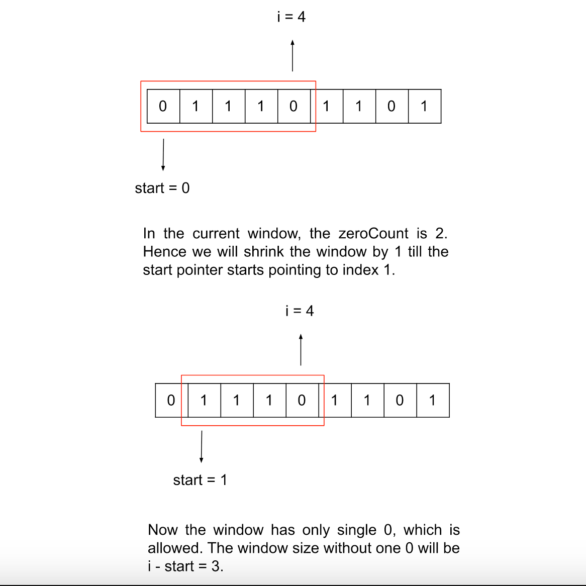

# Solution
## Approach: Sliding Window

### Intuition

We have a binary array nums with size N; we need to delete exactly one element from it and then return the longest subarray having only 1. Since we need to maximize the count of 1 in the subarray, we should not delete a 1, except in the case when the array has all elements as 1 (then we don't have a choice).

Although we need a subarray with all elements as 1, we can afford to have one 0 as we can delete it. We will keep a window and keep adding elements as long as the count of 0s in it doesn't exceed one. Once the number of 0s exceeds one, we will shrink the window from the left side till the count of 0 comes under the limit; then, we can compare the size of the current window with the longest subarray we have got so far.



This algorithm will cover the edge case with no zeroes, as in that case, the zeroCount will never exceed 1, and our window will cover the whole array. In the end, the difference between the first and last index would provide the array size minus 1, which is intended as we need to delete one element.

### Algorithm

1. Initialize three variables:

a. zeroCount to 0; this is the number of zeroes in the current window.

b. longestWindow to 0; this is the longest window having at most one 0 we have seen so far.

c. start to 0; this is the left end of the window from where it starts.

2. Iterate over the array, and keep counting the zeroes in the variable zeroCount.

3. After every element, check if the zeroCount exceeds 1; if yes, keep removing elements from the left until the value of zeroCount becomes <= 1.

4. Update the variable longestWindow with the current window length, i.e. i - start. Note that this subtraction will give the number of elements in the window minus 1, as we need to delete one element too.

5. Return longestWindow.

### Implementation

```Java
class Solution {
    public int longestSubarray(int[] nums) {
        // Number of zero's in the window.
        int zeroCount = 0;
        int longestWindow = 0;
        // Left end of the window.
        int start = 0;

        for (int i = 0; i < nums.length; i++) {
            zeroCount += (nums[i] == 0 ? 1 : 0);

            // Shrink the window until the zero counts come under the limit.
            while (zeroCount > 1) {
                zeroCount -= (nums[start] == 0 ? 1 : 0);
                start++;
            }

            longestWindow = Math.max(longestWindow, i - start);
        }

        return longestWindow;
    }
}
```

### Complexity Analysis

Here, N is the size of the array nums.

    Time complexity: O(N)

    Each element in the array will be iterated over twice at max. Each element will be iterated over for the first time in the for loop; then, it might be possible to re-iterate while shrinking the window in the while loop. No element can be iterated more than twice. Therefore, the total time complexity would equal O(N).

    Space complexity: O(1)

    Apart from the three variables, we don't need any extra space; hence the total space complexity is constant.
