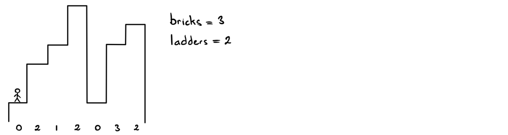
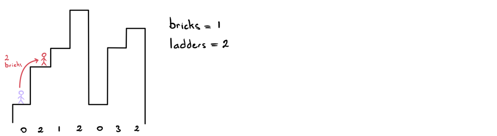
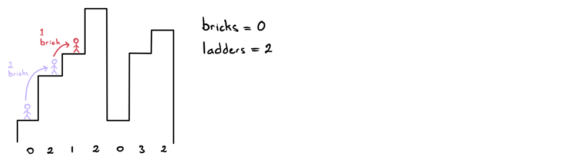
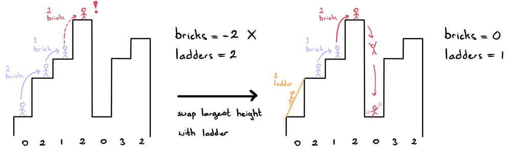
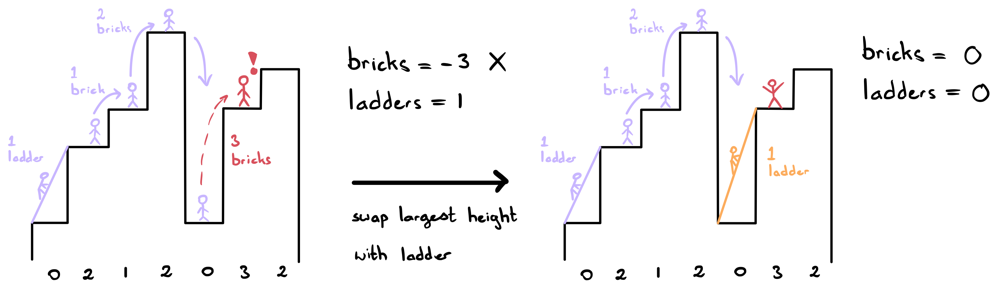

# Visual Explanation | JAVA Max-Heap

## Logic:

The tricky part of this question is identifying when to use a ladder or when to use bricks. At first it may seem like we should only use ladders in situations where we can't use bricks. Actually, this isn't too far from how this implementation works! We can reword this to instead say that we prefer to use ladders at larger height jumps.

We'll use the below example with inputs: heights = [1,3,4,6,1,4,5], bricks = 3, ladders = 2. The numbers below the buildings indicate the height required to jump to that building.



## Key Observation:

If we can hypothetically make it to any index i, then we would like to use our ladders for all the largest jumps and our bricks for the smallest jumps! Observe the following sequences to see how this works in our above example.



To make it to the 2nd building, we can just use 2 bricks since we have 3 bricks at our disposal. This leaves us with 1 brick left.



To make it to the 3rd building, we can just use 1 brick since we have 1 brick left at our disposal. This leaves us with 0 bricks left.



In this case, we cannot make it to the 4th building since we've run out of bricks. Therefore, we swap our largest height jump with a ladder. In this case, we can swapeither of the 2 height jumps. Now we have 1 ladder and still 0 bricks left.



In this case, we cannot make it to the 6th building since we've run out of bricks. Therefore, we swap our largest height jump with a ladder. In this case, we can swap the 3-height jump with a ladder. We've made it as far as possible with no resources left.
How to Implement This in Code:

The algorithm for this is quite simple! We'll store all the non-zero height jumps in a priority queue to represent our max heap. We can do this because we only ever care about the greatest height jump that occurred so far that hasn't been occupied by a ladder. As such, we don't really care about where it is!
Whenever we run out of bricks, we'll add the top of the heap (i.e. the largest height so far) back to our bricks and subtract 1 ladder. If we're out of both supplies, we return our current index.

That's it, now we're ready to code!
Code:

If you have any questions, suggestions or improvements, feel free to let me know. Thanks for reading!

```Java
public int furthestBuilding(int[] heights, int bricks, int ladders) {
	PriorityQueue<Integer> pq = new PriorityQueue<>(Collections.reverseOrder());

	for (int i=0; i<heights.length-1; i++) {
		if (heights[i] >= heights[i+1]) continue;
		bricks -= heights[i+1] - heights[i];
		pq.add(heights[i+1] - heights[i]);

		if (bricks < 0) {
			bricks += pq.poll();
			if (ladders > 0) ladders--;
			else return i;
		}
	}

	return heights.length - 1;
}
```

Time Complexity: O(nlogn) due to the priority queue
Space Complexity: O(n)

