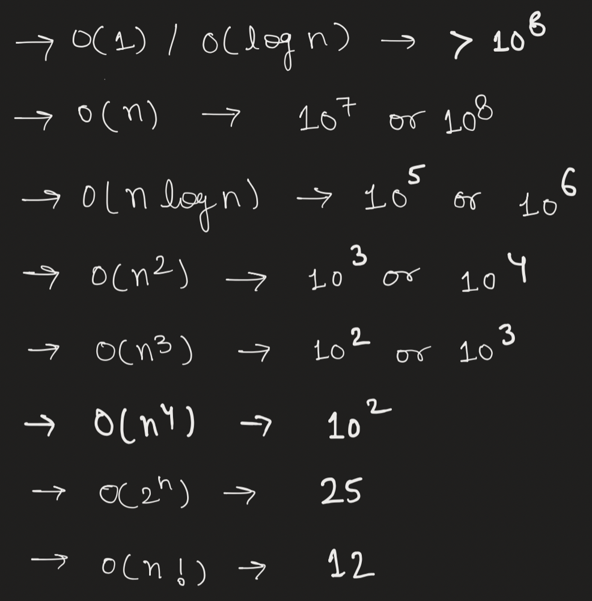

# Why DP fails here ! Greedy Approach - Min Heap

Disclaimer
```
This post is for those ** who just start coding without taking
input size into consideration.
```



## Approach

```
Two points to note here
1. If the next building is on lower or equal height I can move on.

2. If the next building is higher than I have two choices 
I can use ladder or I can use no. of bricks of that height difference.
```

If you are the DP lover, you might be co-relating this problem with knapsack like we have two choice either we can use ladder or we can use bricks.
And some of you might have started writing recursion and when you went for memoization you got to know that you will need 3D DP for sure. But the size is so large that you will get Memory Limit Exceeded. Although I am sharing code for this just for your info.

```Java
class Solution {
    public int furthestBuilding(int[] heights, int bricks, int ladders) {
        int n = heights.length;
        return solve(heights, 0, bricks, ladders);
    }

    public int solve(int[] heights, int i, int bricks, int ladders) {
        if(i == heights.length-1) return i;
        int diff = heights[i+1] - heights[i];
        if(diff > 0) {
            int ans = i;
            if(bricks >= diff) {
                ans = Math.max(ans, solve(heights, i+1, bricks - diff, ladders));
            }
            if(ladders > 0) {
                ans = Math.max(ans, solve(heights, i+1, bricks, ladders-1));
            }
            return ans;
        } else {
            return solve(heights, i+1, bricks, ladders);
        }
    }
}
```

It will give TLE. Because we haven't done memoization. Let's do memoization

```Java
class Solution {

    Integer[][][] memo;

    public int furthestBuilding(int[] heights, int bricks, int ladders) {
        int n = heights.length;
        memo = new Integer[n+1][bricks+1][ladders+1];
        return solve(heights, 0, bricks, ladders);
    }

    public int solve(int[] heights, int i, int bricks, int ladders) {
        if(i == heights.length-1) return i;
        
        if(memo[i][bricks][ladders] != null) return memo[i][bricks][ladders];

        int diff = heights[i+1] - heights[i];
        if(diff > 0) {
            int ans = i;
            if(bricks >= diff) {
                ans = Math.max(ans, solve(heights, i+1, bricks - diff, ladders));
            }
            if(ladders > 0) {
                ans = Math.max(ans, solve(heights, i+1, bricks, ladders-1));
            }
            return memo[i][bricks][ladders] = ans;
        } else {
            return memo[i][bricks][ladders] = solve(heights, i+1, bricks, ladders);
        }
    }
}
```

Although I have checked the input size that it would give me Memory Limit, I thought of giving it a try.

And yes, I got Memory Limit Exceeded .

So Now you need to remember one thing for rest of your life

Rule#96
```
GREEDY >>>> DP ( Sorry DP lovers )

Whenever you apply DP in any question, first always try to make this
using simple greedy approach. If greedy fails then go for DP.

Because for DP either you might require O(n^2) or 
sometime for 3D dp O(n^3) time. 

But in greedy which mostly work by sorting data it will be 
in O(n*logn). 

If you closely check the input size is 10^5 so for sure 
we have to do this in O(nlogn) or lower time.
```

Here it's not like I have choice either I can pick ladder or brick, I also need to make sure I reach the maximum index.

So let's say you have to climb 8 and 2, and you have 5 bricks and 1 ladder.

What will you do ?
Obviously you will try to climb the highest using ladder else you will waste too many bricks.

Conclusion
```
So here we know that we will use ladders for the highest 
climb and bricks for the remaining.
```

Now here comes the best part
How will you manage this, like for the highest climb you are using ladders and for other you are using bricks.

1. First of all as we climb one by one, we will use ladders till we are out of ladders.
2. Now when we have consumed our all ladders, now it's our turn to use bricks. Now let's say previously we have use ladders to climb [4, 10, 6] and now we have to climb 5, so now I know that for 5 I should use ladder, and the previously I have used ladder for 4 I will use brick there.
3. So now ladders will be used to climb [10, 6, 5] and bricks for [4].
4. Now let's say I have to climb 2, then obviously I can't use ladders because they are already being used to climb high. SO I will use bricks here. But let's say I have one 1 brick left then I won't be able to climb further.

Now if you have read all 4 points clearly, you got to know that if the climb is lower or equal to the climb made by ladders then we can use brick.
but if we found high climb where previously we have used ladders for the lower climb, I will use ladders here and bricks there.

Final
```
So everytime, I am picking up minimum from ladders if it is less 
or equal to the current climb, I will just use bricks.
Else I will remove the minimum and insert new climb in ladders and 
for the removed climb ( min. from ladders ) I will use bricks.
```

So now every time I need to remove minimum so I can use min-heap here of size ladders.

Let's code now

## Code

```Java
class Solution {
    public int furthestBuilding(int[] heights, int bricks, int ladders) {
        int n = heights.length;
        PriorityQueue<Integer> pq = new PriorityQueue<Integer>();
        for(int i=0;i<n-1;i++) {
            int diff = heights[i+1] - heights[i];
            if(diff > 0) {
                if(pq.size() < ladders) {
                    pq.add(diff);
                } else {
                    if(pq.isEmpty() || pq.peek() >= diff) {
                        bricks -= diff;
                    } else {
                        int poll = pq.poll();
                        pq.add(diff);
                        bricks -= poll;
                    }
                    if(bricks < 0) return i;
                }
            }
        }
        return n-1;
    }
}
```

## Complexity

* Time complexity: O(n*logk) where k = ladders because heap size would always be k.

* Space complexity: O(k)

Rule#97
```
As a Software Engineer, I work on three principles - 
1. Make it work ( write brute force )
2. Optimise it ( optimise the brute force )
3. Clean it ( clean the optimised code )
```

Now we have optimised our code and there is no further optimisation I can see

So now I will work on making this code more cleaner.

TIP
```
Because the code we write is mostly read by humans than leetcode
compiler.
```

So let's write clean code for it ( If you have understood previous solution, it won't be hard to figure this out )

```Java
class Solution {
    public int furthestBuilding(int[] heights, int bricks, int ladders) {
        PriorityQueue<Integer> pq = new PriorityQueue<Integer>();
        for(int i=0;i<heights.length-1;i++) {
            int diff = heights[i+1] - heights[i];
            if(diff <= 0) continue;
            pq.add(diff);
            if(pq.size() > ladders) bricks -= pq.poll();
            if(bricks < 0) return i;
        }
        return heights.length-1;
    }
}
```

Time & Space Complexity would be same as previous.

Now one more thing before I close this post, in above approach we have take heap to store minimum in heap because we will use ladders for maximum.
You can take maximum heap which will store bricks because we want minimum bricks to be used.

Rule#99
```
So as a programmer, you should think from all sides.
```

Now for beginners, who don't know what is priority queue, you can use an array of size k ( ladders ) and it should be sorted. So that your first element is always minimum. So if you want to insert new element either you can update it at first index and again sort it. But if you know binary search than you can find the position to insert in array and then shift elements so that it is still sorted. ( But I would recommend you read about priority queue, It's not a rocket science. )

Summary
```
1. Before going for DP, try to think atleast from greedy persepective.
2. You can use min-heap of size k to always maintain the data having
   value more than m ( where m is minimum ). So your m would be the 
   k largest element here. ( Try to read K largest or K smallest ).
```

That's all from my side ...

Now I've one tip for you guys

Rule#100
```
Be Calm and Crack Jokes in Tough Situations as well !!!

If you are software engineer, or in the road of becoming.
There would be sometimes when something bad happens or some
bug that will ruin your whole day / week.

But Remember one thing no matter what happens, even if you lose
the job or you done something wrong on production. 
Not only you if your juniors do something terribly wrong. 
First try to solve it asap and handle the sitation calmly.

Don't loose your humour in any situations.
```

