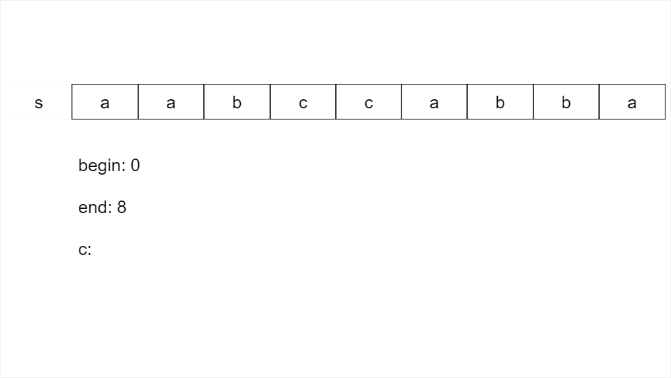
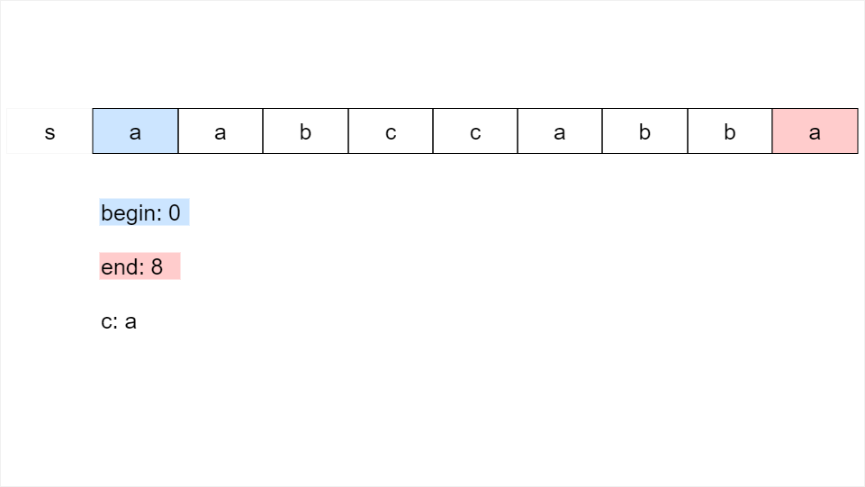
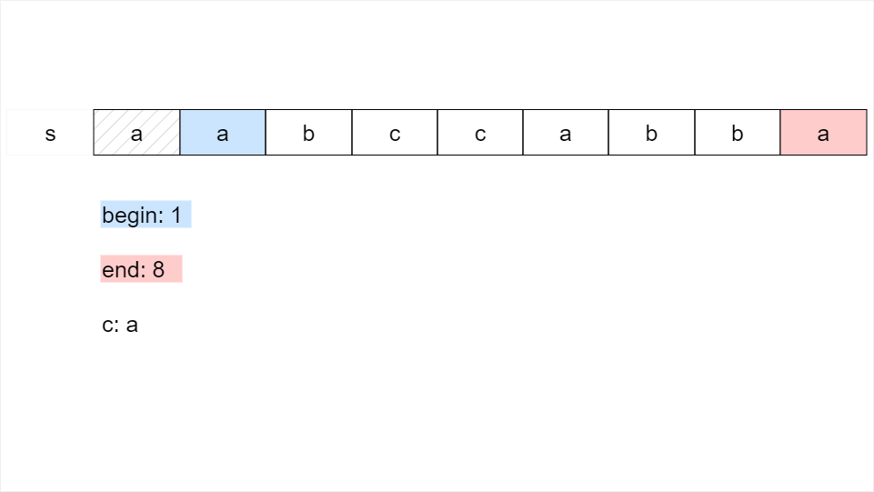
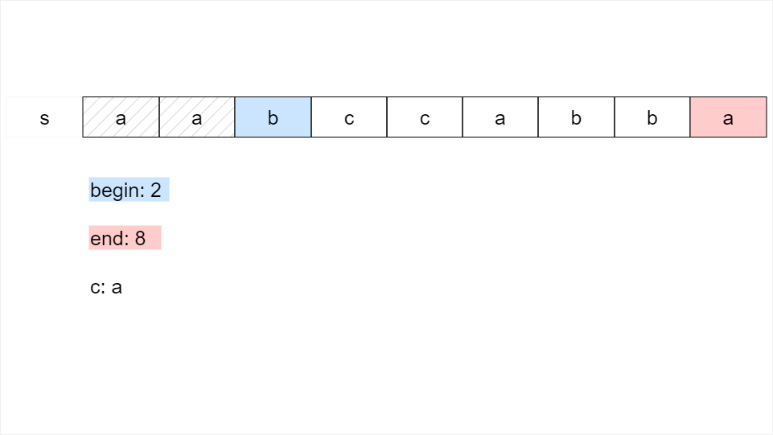
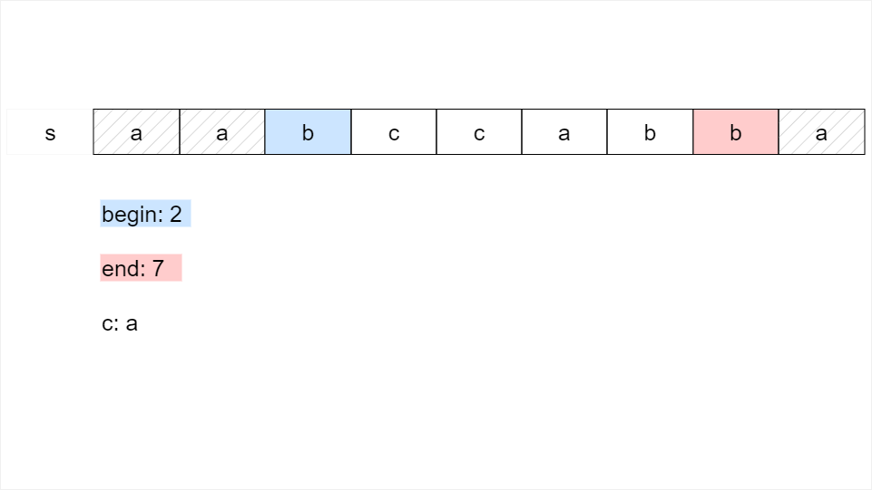
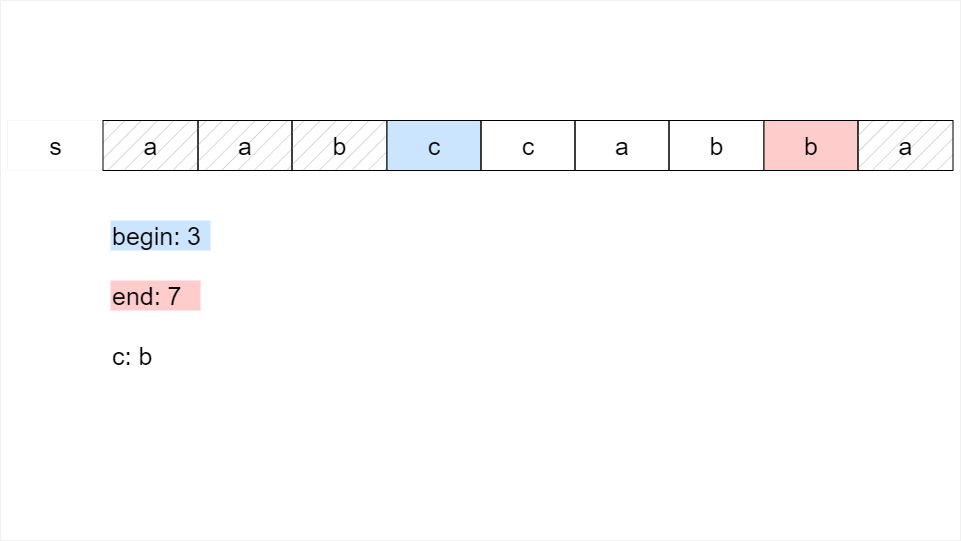
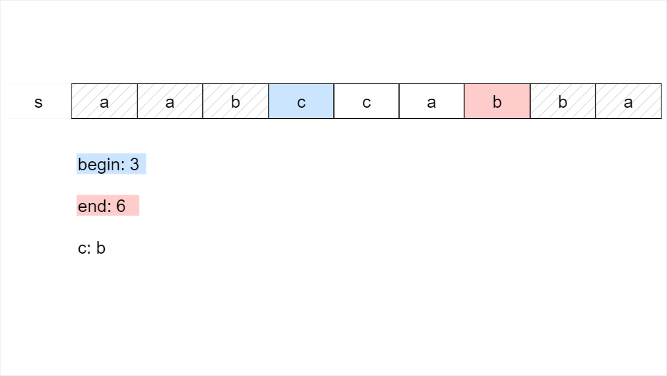
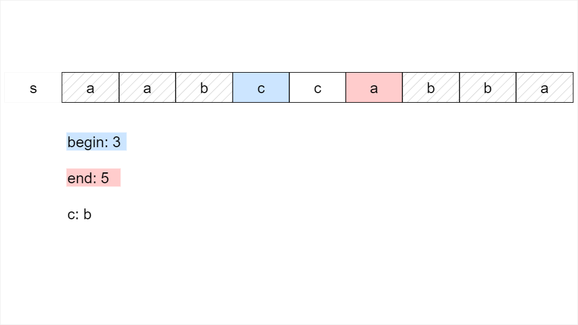
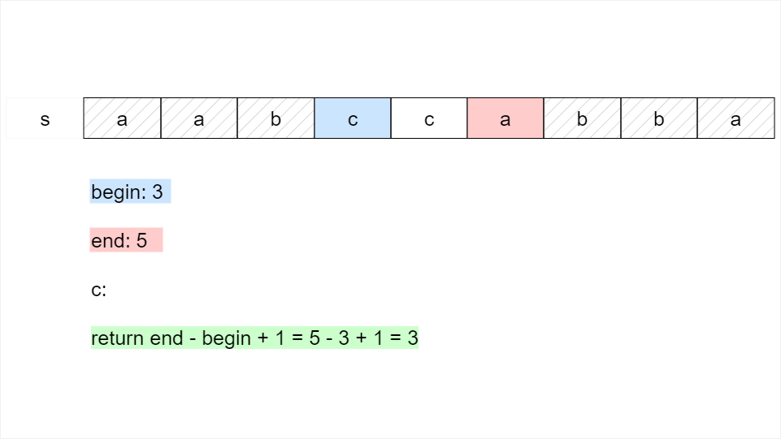

# Solution
## Overview

Given a string s, we aim to return the length of s after deleting similar ends.

When the characters at the beginning and end of s are the same, we can delete the prefix and suffix. A prefix or suffix can contain multiple of the same character. The prefix and suffix can be of different lengths, but must not intersect.

Note that the objective is to find the length of s after deleting characters, not to return the modified string. The best practice is not to modify the input; we can count the remaining characters after identifying characters we would delete.

## Approach 1: Two Pointers

### Intuition

After deleting similar ends, our goal is to find the number of characters remaining in s.

**When can we delete the prefix and suffix?**

We can delete the prefix and suffix when the character at the beginning of s is the same as the character at the end of s. Let's call this character c.

As shown in example 3 from the problem description, for a given character c, we can delete multiple occurrences of it as the prefix and suffix. For the input s = "aabccabba", two occurrences of "a" are deleted as the prefix, and one occurrence of "a" is deleted as the suffix.

When the characters at the beginning and end of s both equal c, we can delete characters at the beginning of s until the first character of s no longer equals c. Then, we can delete the characters at the end of s until the last character of s no longer equals c.

We can compare the characters at the beginning and end of s by using two pointers: begin, which points to the beginning of s, and end, which points to the end.

To "delete" a character, we move the begin or end pointer one step to the center.

We can process s with these pointers until they meet in the middle or the characters at the beginning and end of the substring of s differ. When we cannot delete more characters, we find the remaining characters. The characters between begin and end are the remaining characters. To calculate the number of remaining characters, we can subtract begin from end; then we add 1, because the string is 0-indexed.

> **How do we know this approach will delete all similar ends?**

> With each iteration, begin is incremented to delete the prefix, and end is decremented to delete the suffix, unless all remaining characters are the same, in which case the begin pointer is used to delete both the prefix and suffix. The pointers move towards each other, so we will process a prefix and suffix with each iteration.

> Our algorithm stops in three cases:
1. The character at s[begin] is different from the character at s[end]: every time we delete a character, we delete all occurrences of that character on each end. This means that when there are no longer similar ends, we have deleted them all.
2. begin is equal to end: we have processed the whole string and deleted all but 1 character; we can no longer delete a separate prefix and suffix, so all similar ends have been deleted.
3. begin is greater than end: we have processed and deleted the whole string.

Below is a visualization of the two-pointer method for deleting similar ends:












### Algorithm

1. Initialize two variables, begin to 0 and end to s.length() - 1. begin points to the first index of s and end points to the last index.
2. While begin is less than end and the character at s[begin] equals the character at s[end]:
   * Initialize a character c to s[begin].
   * While begin is less than or equal to end and s[begin] equals c, increment begin by 1 to delete a prefix character.
   * While end is greater than begin and s[end] equals c, decrement end by 1 to delete a suffix character.
3. After processing s, return end - begin + 1, the number of remaining characters.

### Implementation

#### **Implementation 1: Iterative**

Java

```Java
public class Solution {
    public int minimumLength(String s) {
        int begin = 0;
        int end = s.length() - 1;

        // Delete similar ends until the ends differ or they meet in the middle
        while (begin < end && s.charAt(begin) == s.charAt(end)) {
            char c = s.charAt(begin);

            // Delete consecutive occurrences of c from prefix
            while (begin <= end && s.charAt(begin) == c) {
                begin++;
            }

            // Delete consecutive occurrences of c from suffix
            while (end > begin && s.charAt(end) == c) {
                end--;
            }
        }

        // Return the number of remaining characters
        return end - begin + 1;
    }
}
```

#### **Implementation 2: Tail Recursion**

We can implement the above approach recursively as well as iteratively. We can delete similar ends, and then recursively delete similar ends on the remaining string.

We use a helper function, deleteSimilarEnds, so we can pass begin and end as parameters. The base case is when a prefix and suffix cannot be deleted because the ends differ or meet in the middle. In this case, we return the number of remaining characters.
When there are similar ends, the function deletes them using a similar process as the above implementation and recursively calls itself.

In a recursive function, each recursive call creates a new stack frame, which can lead to a stack overflow if the function is called too many times. Tail recursion reduces this problem by reusing the current stack frame instead of creating a new one.
It's an optimization technique used in functional programming to avoid the use of explicit loops and improve performance.

To use tail recursion, the last statement of a function must be a recursive call, and the function must have a base case that can be reached by the recursive call. The base case is used to stop the recursion and return a value.
Since our approach has both conditions, we can use tail recursion in the below implementation.

> Note: The implementation shown here is provided for the purpose of building perspective on different ways to solve a problem. While the recursion-based solution is valid, the two-pointer implementation remains the most intuitive and optimized solution.

Java

```Java
public class Solution {
    public int minimumLength(String s) {
        return deleteSimilarEnds(s, 0, s.length() - 1);
    }

    // Deletes similar ends and returns remaining length
    private int deleteSimilarEnds(String s, int begin, int end) {
        // The ends differ or meet in the middle
        if (begin >= end || s.charAt(begin) != s.charAt(end)) {
            return end - begin + 1;
        } else {
            char c = s.charAt(begin);

            // Delete consecutive occurrences of c from prefix
            while (begin <= end && s.charAt(begin) == c) {
                begin++;
            }

            // Delete consecutive occurrences of c from suffix
            while (end > begin && s.charAt(end) == c) {
                end--;
            }

            return deleteSimilarEnds(s, begin, end);
        }
    }
}
```

The time complexity of the recursive implementation is the same as the iterative implementation. The main space required for this recursive implementation is the call stack, which can grow as large as the number of recursive calls. There will be a recursive call for each pair of similar ends, and there can be as many as n/2 similar ends, so our implementation will have n/2 recursive calls. n/2 is a linear complexity, so we describe the space complexity as O(n).

### Complexity Analysis

Let n be the length of s.

* Time complexity: O(n)

We process s using the pointers begin and end until they meet in the middle. Although we use nested while loops, with each iteration, begin is incremented, and/or end is decremented, or the loop terminates because a prefix and suffix can no longer be deleted. We handle each character of s at most once, so the time complexity is O(n).

* Space complexity: O(1)

The iterative implementation uses a few variables and no additional data structures that grow with input size, so the space complexity is constant, O(1).
