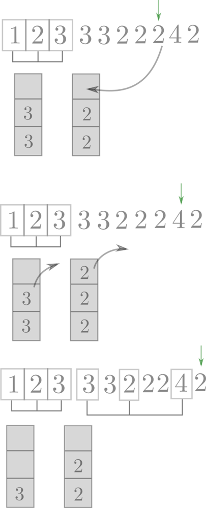
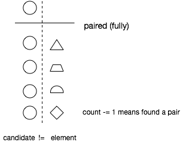

# Majority Element II

### solution from walkccc.me (the Boyer-Moore Majority Vote algorithm)

```Java
public List<Integer> majorityElement2(int[] nums) {
    List<Integer> ans = new ArrayList<>();
    int candidate1 = 0;
    int candidate2 = 1;  // any number different from candidate1
    int countSoFar1 = 0; // the number of candidate1 so far
    int countSoFar2 = 0; // the number of candidate2 so far

    for (final int num : nums)
        if (num == candidate1) {
            ++countSoFar1;
        } else if (num == candidate2) {
            ++countSoFar2;
        } else if (countSoFar1 == 0) { // Assign the new candidate.
            candidate1 = num;
            ++countSoFar1;
        } else if (countSoFar2 == 0) { // Assign the new candidate.
            candidate2 = num;
            ++countSoFar2;
        } else { // Meet a new number, so pair with the previous counts.
            --countSoFar1;
            --countSoFar2;
        }

    int count1 = 0;
    int count2 = 0;

    for (final int num : nums)
        if (num == candidate1)
            ++count1;
        else if (num == candidate2)
            ++count2;

    if (count1 > nums.length / 3)
        ans.add(candidate1);
    if (count2 > nums.length / 3)
        ans.add(candidate2);
    return ans;
}
```

### Explanation by GPT

The given solution is based on the Boyer-Moore Majority Vote algorithm, which is an efficient algorithm for finding the majority element in an array. The approach is explained in detail below:

1. **Initialization:**
   - Initialize two candidates (`candidate1` and `candidate2`) and their respective counters (`countSoFar1` and `countSoFar2`).
   - Initially, set `candidate1` to any number in the array and `candidate2` to a different number.

2. **Voting Process:**
   - Iterate through the array, and for each element (`num`):
     - If `num` is equal to `candidate1`, increment `countSoFar1`.
     - If `num` is equal to `candidate2`, increment `countSoFar2`.
     - If `countSoFar1` is 0, update `candidate1` to the current `num` and increment `countSoFar1`.
     - If `countSoFar2` is 0, update `candidate2` to the current `num` and increment `countSoFar2`.
     - If none of the above conditions are met, decrement both `countSoFar1` and `countSoFar2`.

3. **Count Occurrences:**
   - After the voting process, reset `countSoFar1` and `countSoFar2` to 0.
   - Iterate through the array again and count the occurrences of `candidate1` and `candidate2`.

4. **Check for Majority Elements:**
   - Check if the counts of `candidate1` and `candidate2` are greater than `nums.length / 3`.
   - If the count of `candidate1` is greater than `nums.length / 3`, add `candidate1` to the result list.
   - If the count of `candidate2` is greater than `nums.length / 3`, add `candidate2` to the result list.

5. **Return Result:**
   - Return the list containing the majority elements.

The key insight in this algorithm is that if an element appears more than `n/3` times, there can be at most two such elements. The algorithm efficiently identifies these two potential candidates using the voting process and then verifies their counts to determine if they are indeed majority elements. The final result is a list of the majority elements in the array.

---

### from leetcode solutions

#### Boyer-Moore Majority Vote algorithm and my elaboration

For those who aren't familiar with Boyer-Moore Majority Vote algorithm,
I found a [great article](http://goo.gl/64Nams) that helps me to understand this fantastic algorithm!!
Please check it out!

The essential concepts is you keep a counter for the majority number X. If you find a number Y that is not X, the current counter should deduce 1. The reason is that if there is 5 X and 4 Y, there would be one (5-4) more X than Y. This could be explained as "4 X being paired out by 4 Y".

And since the requirement is finding the majority for more than ceiling of [n/3], the answer would be less than or equal to two numbers.
So we can modify the algorithm to maintain two counters for two majorities.

Followings are my sample Python code:

```Python
class Solution:
# @param {integer[]} nums
# @return {integer[]}
def majorityElement(self, nums):
    if not nums:
        return []
    count1, count2, candidate1, candidate2 = 0, 0, 0, 1
    for n in nums:
        if n == candidate1:
            count1 += 1
        elif n == candidate2:
            count2 += 1
        elif count1 == 0:
            candidate1, count1 = n, 1
        elif count2 == 0:
            candidate2, count2 = n, 1
        else:
            count1, count2 = count1 - 1, count2 - 1
    return [n for n in (candidate1, candidate2)
                    if nums.count(n) > len(nums) // 3]
```

---

### from leetcode solutions

#### Boyer–Moore majority vote algorithm EXPLAINED ^^

Solution: Boyer–Moore majority vote algorithm O(N), O(1)

I've read a few explanations of this algorithm, but I feel a need for a more detailed talk. Here's my take on this algorithm, hope it will help somebody.

```cpp
class Solution {
public:
  vector<int> majorityElement(vector<int> &a) 
  {
	  int y(-1), z(-1), cy(0), cz(0);
    
	  for (const auto & x: a) 
	  {
		  if (x == y) cy++;
		  else if (x == z) cz++;
		  else if (! cy) y = x, cy = 1;
		  else if (! cz) z = x, cz = 1;
		  else cy--, cz--;
     }
      
     cy = cz = 0;
     for (const auto & x: a)
		 if (x == y) cy++;
			 else if (x == z) cz++;
  
	  vector<int> r;
	  if (cy > size(a)/3) r.push_back(y);
	  if (cz > size(a)/3) r.push_back(z);
	  return r;
  }
};
```

This is a two-pass algorithm: the first pass chooses two candidates, the second pass either confirms or rejects each of them.

##### Explanation: Forming triples

☝ Before we start you may want to get a feeling of Boyer–Moore ⌊ n/2 ⌋ majority vote algorithm (explanation [here](https://leetcode.com/problems/majority-element/discuss/543431/Majority-vote-algorithm-EXPLAINED-(with-pictures))).

The main point of this algorithm is to form triples of different numbers like these (1,2,3), (1,3,4): the leftovers after this triple-forming procedure will be our majority candidates. Two different triples may coinside (e.g. (1,2,3), (1,2,3)). These triples are formed under the hood and never articulated, so it's a bit hard to see them at first. These triples are produced when the two counters are decreased (in the ultimate else section where -- occur). Let me elaborate on how this is done exactly and then I'll explain what do we need those triples for.
How to form triples of different elements

If our vector consisted of different elements triples production would be easy: we would traverse the array and form triples out of 3 consecutive elements.


When we have duplicates we have an excess of some elements and we can't use them unless we encounter some fresh elements.
In order to remember what elements we had an excess of we can use a stack (two stacks in fact.). I hope these two pictures will clarify the process.



Note that we should put into stack the elements of only one kind. The triple is formed when we simultaniously pop two different elements from our staches and take current element from the array. If current element equals elements in one of the stacks we can't form a proper triple and push current element into the respective stack.

The next observation is that we don't need all these stacks as they contain identical elements and we can substitute them with two variables y and z and their counters cy and cz.
Let's take a look how triples are formed in this process


Here the following triples are formed: (1, 2, 3), (1, 2, 3), (1, 2, 3), (1, 4, 3) . Note that "-"'s occur simultanuosly for the two counters but "+"'s occur to only one of them. Also every step leads to either "+" or "-". "+" means that we were unable to form a triple because we didn't have enough different elements at our disposal when the current element matched with one of the two types of stashed elements and we need to stash this element as well for the future.
Why do we need triples ?

Why do we partition the elements into triples with different elements in each triple? It's because the leftovers after this procedure are the candidates for the majority elements. There will be elements of only two types in the leftovers (otherwise we could make a triple of them). Note that triples contain only different elements and there could be no more than ⌊ n/3 ⌋ of them. So even if majority element would appear in every one of ⌊ n/3 ⌋ triples there will be leftover of it. That's why majority elements (if present) are guaranted to be among the leftovers.

UPD. Thanks for all the nice words in the comments :)

### from comments to it

* > Now this makes sense. Its like Count is stash and pairing with other elements means we need to decrease count from stash. Left-Overs are either access count or just new unique element which not participated enough in pairing.
<br>That's why second loop to remove false positive cases.
Why need triplets: Because we are finding elements > n/3.
<br>Lets understand for majority element: > n/2 or we can say 50%
[1,1,2,3,1]
Here we need to focus on tuples. (1,2), (1,3) means 1 is cancelled out by 2 and 3 in two occasions. The left over is last: "1" and can be rechecked if it really is majority element.
[1,1,2,3,4]: The reason why we need second loop: (1,2) and (1,3) cancelled out 1 in two occasions, but left over is "4", which is not majority element.
Note: But if it is given that majority element is present, then we don;t need second loop for that. Why because in that case we are pretty sure there will be left over and it is not false positive. Keep in mind that is only true for > 50% element case and not for others because number of elements > 1 as potential output.
<br>Now lets generalize it for > n/3 ? We cancel out access elements by forming triplets.
For > n/4 We can cancel out access elements by forming quadruplets. and so on and so forth.
<br>Thanks the Stack Diagram really helped me to visualize this, other posts with count only did not helped.

---

### from leetcode solutions

#### My understanding of Boyer-Moore Majority Vote

This problem is an extension to [169. Majority Element](https://leetcode.com/problems/majority-element/), which needs Boyer-Moore Majority Vote Algorithm to find the element, whose count is over n/2.

When I was learning about Boyer-Moore, I was always thinking about the pair. I drew a picture to get myself understandable.

Suppose there are nine elements in array A, and the round one is the majority.


No matter in what order we select element from the array, we can only get two results


Compared to fully pairing, it is a little wasting of the partially pairing as there are some round ones are not paired (definitely it would be left). So, under the condition that the majority element exists, we could only think about the fully pairing situation. (It's useful when dealing with n/3 situation)

We can consider either column as the candidate, and it's intuitive for me to get understand that the code means found a pair.

```
if candidate != element
  count -= 1
end
```



So here comes the n/3 problem, we would only think about the fully pairing situation. If the over one third majority exists, it should be left after pairing.


Why would we use three elements as a pair? Because it makes sure that in fully pairing the count of majority element equalsn/3.

That's my understanding about Boyer-Moore. Maybe it's not so clear, but it helps me think about it.

Code

```Ruby
# Modified Boyer-Moore Majority Voting Algorithm
def majority_element(nums)
  candidate1, candidate2 = 0, 0
  count1, count2 = 0, 0

  # first round to find candidates
  nums.each do |num|
    if candidate1 == num
      count1 += 1

    elsif candidate2 == num
      count2 += 1

    elsif count1 == 0
      candidate1 = num
      count1 += 1

    elsif count2 == 0
      candidate2 = num
      count2 += 1

    else
      # This condition is important, which means a pair out,
      # filtering a set of three elements out

      count1 -= 1
      count2 -= 1
    end
  end

  # second round to confirm
  result = []
  [candidate1, candidate2].uniq.each do |candidate|
    result << candidate if nums.count(candidate) > (nums.count/3)
  end

  result
end
```

Reference

* [Boyer-Moore Majority Vote algorithm and my elaboration by orbuluh](https://discuss.leetcode.com/topic/17564/boyer-moore-majority-vote-algorithm-and-my-elaboration)

* [Majority Voting Algorithm - Blog of Greg Grothaus](https://gregable.com/2013/10/majority-vote-algorithm-find-majority.html)

* [Boyer-Moore Majority Vote Algorithm](http://www.cs.rug.nl/~wim/pub/whh348.pdf)

### from comments to it

* > The best diagram ever, it helps me finally understand!
    <br>A quick math proof for "If there exists a majority element, it must appear at the end.", I think it would be sth like this (e.g. for n/3 case):
    1. Each time you found a triplet, you remove 3 distinct elements.
    2. Suppose there are k such removals, you will remove 3*k elements.
    3. You can only remove N elements at most after the algorithm terminates, so it must be that 3*k <= N or k <= N/3.
    4. For a majority element m, from 1., each removal can only have one m at best. So in total, we can remove m at most k times before the algorithm stops.
    5. But the majority element m has more than N/3 elements by definition, and since k <= N/3, m must be left in candidates at the end!

* > also related post:
    * [Generalize the Boyer–Moore majority vote algorithm](https://coldfunction.com/mgen/p/3n)
    * [Wiki: Boyer–Moore majority vote algorithm](https://en.wikipedia.org/wiki/Boyer%E2%80%93Moore_majority_vote_algorithm)

---

### from leetcode solutions

#### HashMap & Boyer-Moore Majority Voting

##### Problem Description

The problem is to identify elements in an integer array, nums, of size n, that appear more than ⌊n/3⌋ times and return them as an output.


* Constraints:
    * `1 <= nums.length <= 5 * 10e4`
    * `-10e9 <= nums[i] <= 10e9`


Seems Easy! 😃
##### Intuition

Hi there everyone 😃,

Let's see our today interesting problem, We are required to return the number that has appeared more than ⌊n/3⌋ times in our array.🤔
Seems Interesting.🤩

We know that we need something here, count the number of occurencies and store them somewhere and then return the required elements.😃

It's a job for HASHMAPS !!🦸‍♂️🦸‍♂️
Our hero today is the HashMap since, we can store the number of occurencies for each unique element and then return the elements that have appeared more than ⌊n/3⌋ times.🚀🚀

It is an easy solution. Can we do better ?🤔
Actually, We can 🤯🤯
There is an interesting observation we want to look at.👀

```
EX1 : Array = [1, 2, 2, 4, 4, 4]
Answer  = [4]
```

```
EX2 : Array = [1, 2, 2, 2, 4, 4, 4]
Answer  = [2, 4]
```

```
EX3 : Array = [1, 1, 2, 2, 2, 4, 4, 4]
Answer  = [2, 4]
```

```
EX4 : Array = [1, 1, 1, 2, 2, 2, 4, 4, 4]
Answer  = []
```

I think we have something here.🤔
Since we are required to return elements that appeared more than ⌊n/3⌋ times then we have atmost two elements that we can return.💪

But how two elements ???
Since we want to return elements that appeared more than ⌊n/3⌋ times then atleast it must have appeared ⌊n/3⌋ + 1 times.
⌊n/3⌋ + 1 is greater than the third of the array so

```
`⌊n/3⌋ + 1` * 3 > array size
```

So, it is impossible to return more than two elements.😔

How can we utilize a great observation like this?🤔
Instead of storing the occurencies of all elements, We can only track the two highest elements that have appeared in our array and return them!🤩
And there is algorithm for that. It is called Boyer-Moore Majority Voting Algorithm.

This algorithm can be used to return the highest K elements that appeared in the array more than array_size/(K+1) times. In our case, K = 2.

* The major Intuition behind this algorithm is that maintaining voting variable for the candidates:
    * Increase the variable if you faced the candidate in your iteration.
    * Decrease the variable if you faced another element.
    * If the variable reaches 0, look for another promising candidate.

Why this work?🤔
Assume we are searching for the element that appeared more than array_size / 2 times, then we are sure that the voting variable can has value array_size / 2 + 1 and if we decreased it for all other elements in the array it will also stay positive enough to tell us the desired candidate.

This is small image illustrating the algorithm for K=1 and the major element is the red square.


And this is the solution for our today problem I hope that you understood it🚀🚀
##### Proposed Approaches
###### 1. HashMap Solution

1. Create an HashMap to store the count of each element.
2. Iterate through the input array and increment the count for each element in the HashMap.
3. Create a vector to store the result and Calculate the threshold count (1/3 of the array size).
4. Iterate through the HashMap and for each element:
    * Check if the element count is greater than the threshold.
    * If yes, add the element to the result vector.
5. Return the vector containing the identified majority elements.

###### Complexity

* Time complexity: O(N)
    
    Since we are iterating over the array then it's a linear complexity and we are iterating over the HashMap that also can be linear complexity, then the total complexity is 2 * N which is O(N)

* Space complexity: O(N)

    Since we are storing the count of occurencies for each unique element in the nums array and the array's elements can all be unique then it is linear complexity which is O(N).

###### 2. Boyer-Moore Majority Voting Solution

1. Create variables to track counts and candidates for potential majority elements.
2. First Pass - Find Potential Majority Elements:
    * Iterate through the input array and identify potential majority element candidates.
    * Update the candidates based on specific conditions.
    * Maintain counts for each candidate.
3. Second Pass - Count Occurrences:
    * Iterate through the input array again to count the occurrences of the potential majority elements.
4. Compare the counts with a threshold to determine the majority elements.
5. Return Majority Elements.

###### Complexity

* Time complexity: O(N)

    Since we are iterating over the array in two passes then the complexity is 2 * N which is O(N).
    
* Space complexity: O(1)

    Since we are only storing constant variables then the complexity is O(1).
    
#### Code
#### HashMap Solution
In Java

```Java
class Solution {
    public List<Integer> majorityElement(int[] nums) {
        // Create a frequency map to store the count of each element
        Map<Integer, Integer> elementCountMap = new HashMap<>();
        
        // Iterate through the input array to count element occurrences
        for (int i = 0; i < nums.length; i++) {
            elementCountMap.put(nums[i], elementCountMap.getOrDefault(nums[i], 0) + 1);
        }
        
        List<Integer> majorityElements = new ArrayList<>();
        int threshold = nums.length / 3;
        
        // Iterate through the frequency map to identify majority elements
        for (Map.Entry<Integer, Integer> entry : elementCountMap.entrySet()) {
            int element = entry.getKey();
            int count = entry.getValue();
            
            // Check if the element count is greater than the threshold
            if (count > threshold) {
                majorityElements.add(element);
            }
        }
        
        return majorityElements;
    }
}
```

#### Boyer-Moore Majority Voting Solution

In Java

```Java
class Solution {
    public List<Integer> majorityElement(int[] nums) {
        int count1 = 0, count2 = 0; // Counters for the potential majority elements
        int candidate1 = 0, candidate2 = 0; // Potential majority element candidates

        // First pass to find potential majority elements.
        for (int i = 0; i < nums.length; i++) {
            // If count1 is 0 and the current number is not equal to candidate2, update candidate1.
            if (count1 == 0 && nums[i] != candidate2) {
                count1 = 1;
                candidate1 = nums[i];
            } 
            // If count2 is 0 and the current number is not equal to candidate1, update candidate2.
            else if (count2 == 0 && nums[i] != candidate1) {
                count2 = 1;
                candidate2 = nums[i];
            } 
            // Update counts for candidate1 and candidate2.
            else if (candidate1 == nums[i]) {
                count1++;
            } else if (candidate2 == nums[i]) {
                count2++;
            } 
            // If the current number is different from both candidates, decrement their counts.
            else {
                count1--;
                count2--;
            }
        }

        List<Integer> result = new ArrayList<>();
        int threshold = nums.length / 3; // Threshold for majority element

        // Second pass to count occurrences of the potential majority elements.
        count1 = 0;
        count2 = 0;
        for (int i = 0; i < nums.length; i++) {
            if (candidate1 == nums[i]) {
                count1++;
            } else if (candidate2 == nums[i]) {
                count2++;
            }
        }

        // Check if the counts of potential majority elements are greater than n/3 and add them to the result.
        if (count1 > threshold) {
            result.add(candidate1);
        }
        if (count2 > threshold) {
            result.add(candidate2);
        }

        return result;
    }
}
```

* [Boyer-Moore Majority Voting Algorithm Intuition](https://medium.com/@shwetatripathi1290/boyer-moore-majority-voting-algorithm-intuition-803d5e37c1e2)


