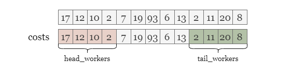
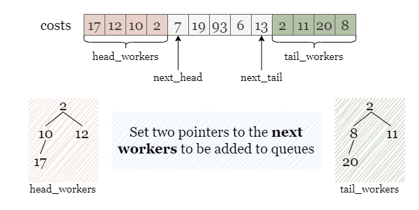
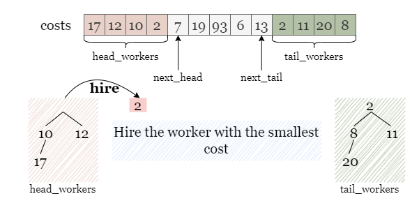
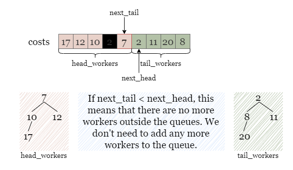
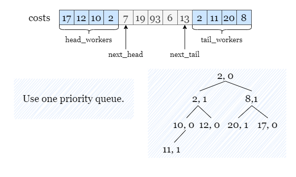
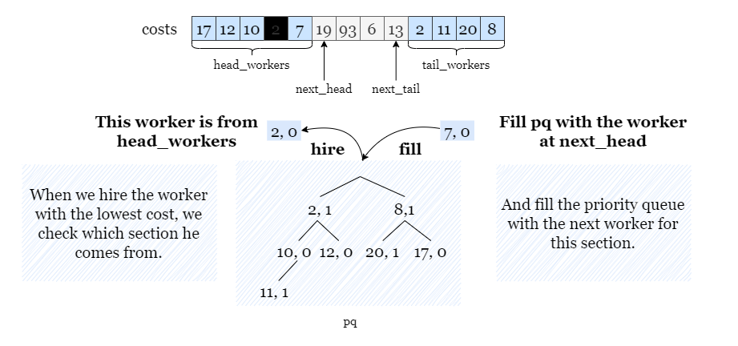

# Solution
## Approach 1: 2 Priority Queues
### Intuition

If you are not familiar with the priority queue, please refer to our explore cards [Heaps Explore Card](https://leetcode.com/explore/featured/card/graph/619/depth-first-search-in-graph/). We will focus on the usage in this article and not the implementation details.

For the sake of brevity, let m represent the input integer candidates for the rest of the article.

To begin with, we need to understand the problem requirements. In each of the k hiring rounds, we must hire a worker with the lowest cost (with the smallest index being a tiebreaker) based on the provided rules.

We have the option to select the worker with the lowest cost from either the first m candidates or the last m candidates from costs. Once we choose a worker from either of these sections, we remove the chosen worker from the array, which makes space for another worker to be in either the first or last m candidates. We continue to select the worker with the lowest cost, each time making space for another worker from costs to be into consideration. Because we need to repeatedly find the minimum cost, using a priority queue is the most appropriate approach to simulate this process.

During each hiring session, our goal is to select the worker with the lowest cost. As mentioned above, after selecting a worker, a spot will open up for another worker to be among the first or last m candidates. As such, we need to distinguish between the first m candidates and the last m candidates. That way, when we choose a worker, we know if a spot was opened in the first m candidates or the last m candidates.



To store the workers in two sections separately, we can use two priority queues, head_workers and tail_workers, where the worker with the lowest cost has the highest priority.


Throughout the process, after we hire a worker from a section, we need to add an additional candidate to this section. Therefore, we need two pointers, next_head and next_tail, that denotes the next worker to be added to the respective queues.



Just like in this situation shown in the picture, if two workers with the same cost appear at the top of both queues, we will hire the one from head_workers, since this worker has a smaller index compared with the other one from tail_workers. Afterwards, we need to refill head_workers with the worker at next_head to ensure that it still contains the first m unselected candidates.



We add the worker costs[next_head] to head_workers, and then increment this pointer by 1, indicating the next unselected worker.


However, if we encounter the condition next_tail < next_head, it indicates that all the workers have been selected as candidates and there are no more workers outside the two queues. To avoid double counting, we should not add a worker to both queues or update either pointer. Therefore, we can simply move on without making any updates to the queues or pointers.



### Algorithm

1. Initialize two priority queues head_workers and tail_workers that store the first m workers and the last m workers, where the worker with the lowest cost has the highest priority.

2. Set up two pointers next_head = m, next_tail = n - m - 1 indicating the next worker to be added to two queues.

3. Compare the top workers in both queues, and hire the one with the lowest cost, if both workers have the same cost, hire the worker from head_workers. Add the cost of this worker to the total cost.

4. If next_head <= next_tail, we need to fill the queue with one worker:
    * If the hired worker is from head_workers, we add the worker costs[next_head] to it and increment next_head by 1.
    * If the hired worker is from tail_workers, we add the worker costs[tail_head] to it and decrement tail_head by 1.

    Otherwise, skip this step.

5. Repeat steps 3 and 4 k times.

6. Return the total cost of all the hired workers.

### Implementation

```Java
class Solution {
    public long totalCost(int[] costs, int k, int candidates) {
        PriorityQueue<Integer> headWorkers = new PriorityQueue<>();
        PriorityQueue<Integer> tailWorkers = new PriorityQueue<>();
        
        // headWorkers stores the first k workers.
        // tailWorkers stores at most last k workers without any workers from the first k workers.
        for (int i = 0; i < candidates; i++) {
            headWorkers.add(costs[i]);
        }
        for (int i = Math.max(candidates, costs.length - candidates); i < costs.length; i++) {
            tailWorkers.add(costs[i]);
        }

        long answer = 0;
        int nextHead = candidates;
        int nextTail = costs.length - 1 - candidates;

        for (int i = 0; i < k; i++) {
            if (tailWorkers.isEmpty() || !headWorkers.isEmpty() && headWorkers.peek() <= tailWorkers.peek()) {
                answer += headWorkers.poll();
                
                // Only refill the queue if there are workers outside the two queues.
                if (nextHead <= nextTail) {
                    headWorkers.add(costs[nextHead]);
                    nextHead++;
                }
            } 
            
            else {
                answer += tailWorkers.poll();

                // Only refill the queue if there are workers outside the two queues.
                if (nextHead <= nextTail) {
                    tailWorkers.add(costs[nextTail]);
                    nextTail--;
                }
            }
        }

        return answer;
    }
}
```

### Complexity Analysis

Let m be the given integer candidates.

    Time complexity: O((k+m)⋅log⁡m)

        We need to initialize two priority queues of size m, which takes O(m⋅log⁡m) time.

        During the hiring rounds, we keep removing the top element from priority queues and adding new elements for up to k times. Operations on a priority queue take amortized O(log⁡m) time. Thus this process takes O(k⋅log⁡m) time.

        Note: in Python, heapq.heapify() creates the priority queue in linear time. Therefore, in Python, the time complexity is O(m+k⋅log⁡m).

    Space complexity: O(m)
        We need to store the first m and the last m workers in two priority queues.

---

## Approach 2: 1 Priority Queue
### Intuition

We can also implement the hiring process using a single priority queue. However, if we only store the costs of the candidates as before, we cannot sort them based on their index. To address this, we can add a new field to each worker to denote their section ID. For instance, we can assign 0 to the first m candidates and 1 to the last m candidates. This way, when two workers have the same cost, the priority queue can sort them based on their section IDs, and the worker with the smaller section ID will be hired. This approach fully meets the requirements given in the problem.

As illustrated in the following picture, we store each candidate in pq, in the format of (cost, section ID). For example:

* costs[1] = 12 is from the head section and stored as (12, 0).

* costs[9] = 2 is from the tail section and stored as (2, 1).



We will proceed with the hiring process for k rounds by hiring the top worker from pq each time.

Similar to the previous solution:

    If we choose a worker from head_workers, we add the worker at next_head to head_workers.
    If we choose a worker from tail_workers, we add the worker at next_tail to tail_workers.

Here, we check whether the hired worker is from the first m candidates or the last m candidates by checking his section ID.

    If the section ID is 0, it means that the worker is from the first m candidates, we add the worker at next_head to pq with a section ID as 0.
    If the section ID is 1, it means that the worker is from the last m candidates, we add the worker at next_tail to pq with a section ID as 1.



### Algorithm

1. Create a priority queue pq and initialize it with the first m workers and last m workers from costs, along with their section IDs (0 for the first m workers, and 1 for the last m workers). The worker with the lowest cost has the highest priority.

2. Initialize two pointers next_head = m and next_tail = n - m - 1, indicating the next worker to be added to pq.

3. Pop the top worker with the lowest cost from pq and add the cost of this hired worker to the total cost.

4. If next_head >= next_tail, we need to fill pq with the next worker:
    * If the hired worker's section ID is 0, we push the worker costs[next_head] to into pq and increment next_head by 1.
    * If the hired worker's section ID is 1, we push the worker costs[next_tail] to into pq and decrement next_tail by 1.

    Otherwise, skip this step.

5. Repeat steps 3 and 4 k times.

6. Return the total cost of all the hired workers.

### Implementation

```Java
class Solution {
    public long totalCost(int[] costs, int k, int candidates) {
        // The worker with the lowest cost has the highest priority, if two players has the
        // same cost, break the tie by their indices (0 or 1).
        PriorityQueue<int[]> pq = new PriorityQueue<>((a, b) -> {
            if (a[0] == b[0]) {
                return a[1] - b[1];
            }
            return a[0] - b[0];});
        
        // Add the first k workers with section id of 0 and 
        // the last k workers with section id of 1 (without duplication) to pq.
        for (int i = 0; i < candidates; i++) {
            pq.offer(new int[] {costs[i], 0});
        }
        for (int i = Math.max(candidates, costs.length - candidates); i < costs.length; i++) {
            pq.offer(new int[] {costs[i], 1});
        }

        long answer = 0;
        int nextHead = candidates;
        int nextTail = costs.length - 1 - candidates;

        for (int i = 0; i < k; i++) {
            int[] curWorker = pq.poll();
            int curCost = curWorker[0], curSectionId = curWorker[1];
            answer += curCost;
            
            // Only refill pq if there are workers outside.
            if (nextHead <= nextTail) {
                if (curSectionId == 0) {
                    pq.offer(new int[]{costs[nextHead], 0});
                    nextHead++;
                } else {
                    pq.offer(new int[]{costs[nextTail], 1});
                    nextTail--;
                }
            }
        }

        return answer;
    }
}
```

### Complexity Analysis

For the sake of brevity, let m be the given integer candidates.

    Time complexity: O((k+m)⋅log⁡m)

        We need to initialize one priority queue pq of size up to 2⋅m, which takes O(m⋅log⁡m) time.

        During k hiring rounds, we keep popping top elements from pq and pushing new elements into pq for up to k times. Operations on a priority queue take amortized O(log⁡m) time. Thus this process takes O(k⋅log⁡m) time.

        Note: in Python, heapq.heapify() creates the priority queue in linear time. Therefore, in Python, the time complexity is O(m+k⋅log⁡m).

    Space complexity: O(m)
        We need to store at most 2⋅m elements (the first m and the last m elements) of costs in the priority queue pq.
