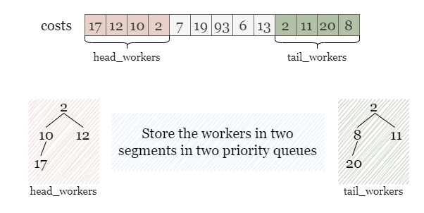
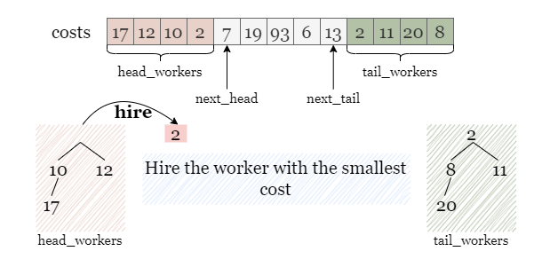
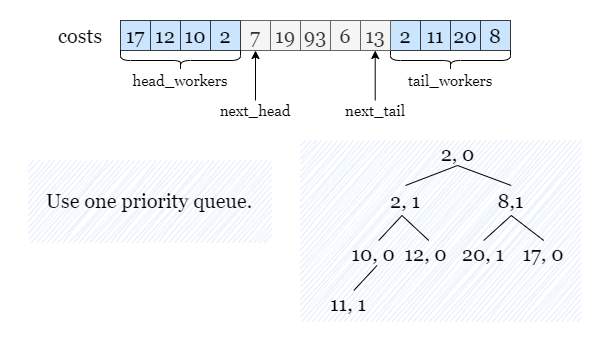
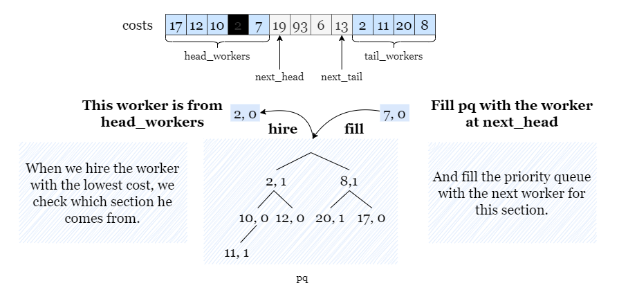

## Solution
---

### Approach 1: 2 Priority Queues
#### Intuition
> If you are not familiar with the priority queue, please refer to our explore cards [Heaps Explore Card](https://leetcode.com/explore/featured/card/graph/619/depth-first-search-in-graph/). We will focus on the usage in this article and not the implementation details.

**For the sake of brevity, let `m` represent the input integer `candidates` for the rest of the article.**

To begin with, we need to understand the problem requirements. In each of the `k` hiring rounds, we must hire a worker with the lowest cost (with the smallest index being a tiebreaker) based on the provided rules.

We have the option to select the worker with the lowest cost from either the first `m` candidates or the last `m` candidates from `costs`. Once we choose a worker from either of these sections, we remove the chosen worker from the array, which makes space for another worker to be in either the first or last `m` candidates. We continue to select the worker with the lowest cost, each time making space for another worker from `costs` to be into consideration. Because we need to repeatedly find the minimum cost, using a priority queue is the most appropriate approach to simulate this process.

During each hiring session, our goal is to select the worker with the lowest cost. As mentioned above, after selecting a worker, a spot will open up for another worker to be among the first or last `m` candidates. That way, when we choose a worker, we know if a spot was opened in the first `m` candidates or the last `m` candidates.


To store the workers in two sections separately, we can use two priority queues, `head_workers` and `tail_workers`, where the worker with the lowest cost has the highest priority.



Throughout the process, after we hire a worker from a section, we need to add an additional candidate to this section. Therefore, we need two pointers, `next_head` and `next_tail`, that denote the next worker to be added to the respective queues.


Just like in this situation shown in the picture, if two workers with the same cost appear at the top of both queues, we will hire the one from `head_workers`, since this worker has a smaller index compared with the other one from `tail_workers`. Afterwards, we need to refill `head_workers` with the worker at `next_head` to ensure that it still contains the first `m` unselected candidates.



We add the worker `costs[next_head]` to `head_workers`, and then increment this pointer by 1, indicating the next unselected worker.


However, if we encounter the condition `next_tail < next_head`, it indicates that all the workers have been selected as candidates and there are no more workers outside the two queues. To avoid double counting, we should not add a worker to both queues or update either pointer. Therefore, we can simply move on without making any updates to the queues or pointers.


#### Algorithm
1. Initialize two priority queues `head_workers` and `tail_workers` that store the first `m` workers and the last `m` workers, where the worker with the lowest cost has the highest priority.
2. Set up two pointers `next_head = m`, `next_tail = n - m - 1` indicating the next worker to be added to two queues.
3. Compare the top workers in both queues, and hire the one with the lowest cost, if both workers have the same cost, hire the worker from `head_workers`. Add the cost of this worker to the total cost.
4. If `next_head <= next_tail`, we need to fill the queue with one worker:
   - If the hired worker is from `head_workers`, add the worker `costs[next_head]` to it and increment `next_head` by 1.
   - If the hired worker is from `tail_workers`, add the worker `costs[tail_head]` to it and decrement `tail_head` by 1.
   - Otherwise, skip this step.
5. Repeat steps 3 and 4 `k` times.
6. Return the total cost of all the hired workers.

#### Implementation

```Java
class Solution {
    public long totalCost(int[] costs, int k, int candidates) {
        PriorityQueue<Integer> headWorkers = new PriorityQueue<>();
        PriorityQueue<Integer> tailWorkers = new PriorityQueue<>();
        
        // headWorkers stores the first k workers.
        // tailWorkers stores at most last k workers without any workers from the first k workers.
        for (int i = 0; i < candidates; i++) {
            headWorkers.add(costs[i]);
        }
        for (int i = Math.max(candidates, costs.length - candidates); i < costs.length; i++) {
            tailWorkers.add(costs[i]);
        }

        long answer = 0;
        int nextHead = candidates;
        int nextTail = costs.length - 1 - candidates;

        for (int i = 0; i < k; i++) {
            if (tailWorkers.isEmpty() || !headWorkers.isEmpty() && headWorkers.peek() <= tailWorkers.peek()) {
                answer += headWorkers.poll();
                
                // Only refill the queue if there are workers outside the two queues.
                if (nextHead <= nextTail) {
                    headWorkers.add(costs[nextHead]);
                    nextHead++;
                }
            } 
            
            else {
                answer += tailWorkers.poll();

                // Only refill the queue if there are workers outside the two queues.
                if (nextHead <= nextTail) {
                    tailWorkers.add(costs[nextTail]);
                    nextTail--;
                }
            }
        }

        return answer;
    }
}
```

## Complexity Analysis
---
Let \(m\) be the given integer `candidates`.

- Time complexity: \(O((k+m) \cdot \log m)\)
  - We need to initialize two priority queues of size \(m\), which takes \(O(m \cdot \log m)\) time.
  - During the hiring rounds, we keep removing the top element from priority queues and adding new elements for up to \(k\) times. Operations on a priority queue take amortized \(O(\log m)\) time. Thus this process takes \(O(k \cdot \log m)\) time.
  - Note: in Python, `heapq.heapify()` creates the priority queue in linear time. Therefore, in Python, the time complexity is \(O(m+k \cdot \log m)\).

- Space complexity: \(O(m)\)
  - We need to store the first \(m\) and the last \(m\) workers in two priority queues.

---

## Approach 2: 1 Priority Queue
### Intuition
We can also implement the hiring process using a single priority queue. However, if we only store the costs of the candidates as before, we cannot sort them based on their index. To address this, we can add a new field to each worker to denote their section ID. For instance, we can assign `0` to the first `m` candidates and `1` to the last `m` candidates. This way, when two workers have the same cost, the priority queue can sort them based on their section IDs, and the worker with the smaller section ID will be hired. This approach fully meets the requirements given in the problem.

As illustrated in the following picture, we store each candidate in `pq`, in the format of `(cost, section ID)`. For example:
- `costs[1] = 12` is from the head section and stored as `(12, 0)`.
- `costs[9] = 2` is from the tail section and stored as `(2, 1)`.



We will proceed with the hiring process for `k` rounds by hiring the top worker from `pq` each time.

Similar to the previous solution:
- If we choose a worker from `head_workers`, we add the worker at `next_head` to `head_workers`.
- If we choose a worker from `tail_workers`, we add the worker at `next_tail` to `tail_workers`.

Here, we check whether the hired worker is from the first `m` candidates or the last `m` candidates by checking his section ID:
- If the section ID is `0`, it means that the worker is from the first `m` candidates, we add the worker at `next_head` to `pq` with a section ID as `0`.
- If the section ID is `1`, it means that the worker is from the last `m` candidates, we add the worker at `next_tail` to `pq` with a section ID as `1`.



## Algorithm
---
1. Create a priority queue `pq` and initialize it with the first `m` workers and last `m` workers from `costs`, along with their section IDs (0 for the first `m` workers, and 1 for the last `m` workers). The worker with the lowest cost has the highest priority.

2. Initialize two pointers `next_head = m` and `next_tail = n - m - 1`, indicating the next worker to be added to `pq`.

3. Pop the top worker with the lowest cost from `pq` and add the cost of this hired worker to the total cost.

4. If `next_head >= next_tail`, we need to fill `pq` with the next worker:
   - If the hired worker's section ID is `0`, we push the worker `costs[next_head]` to into `pq` and increment `next_head` by 1.
   - If the hired worker's section ID is `1`, we push the worker `costs[next_tail]` to into `pq` and decrement `next_tail` by 1.
   - Otherwise, skip this step.

5. Repeat steps 3 and 4 `k` times.

6. Return the total cost of all the hired workers.

## Implementation
---
[View Code on LeetCode](https://leetcode.com/playground/ep4hDwjw/shared)

## Complexity Analysis
---
For the sake of brevity, let \(m\) be the given integer `candidates`.

- Time complexity: \(O((k+m) \cdot \log m)\)
  - We need to initialize one priority queue `pq` of size up to \(2 \cdot m\), which takes \(O(m \cdot \log m)\) time.
  - During \(k\) hiring rounds, we keep popping top elements from `pq` and pushing new elements into `pq` for up to \(k\) times. Operations on a priority queue take amortized \(O(\log m)\) time. Thus this process takes \(O(k \cdot \log m)\) time.
  - Note: in Python, `heapq.heapify()` creates the priority queue in linear time. Therefore, in Python, the time complexity is \(O(m+k \cdot \log m)\).

- Space complexity: \(O(m)\)
  - We need to store at most \(2 \cdot m\) elements (the first \(m\) and the last \(m\) elements) of `costs` in the priority queue `pq`.
