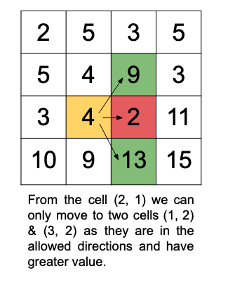

# Solution

## Overview

We have an M x N matrix called grid, filled with positive integers. The challenge is to start from any cell in the first column and find out how many moves we can make to the right while following specific rules.

From any cell (i, j) in the first column, we can move to the next column in one of three ways:

* Directly right to the cell (i, j + 1).
* Diagonally up-right to the cell (i - 1, j + 1).
* Diagonally down-right to the cell (i + 1, j + 1).

However, there's an important condition: we can only make a move if the value in the destination cell is greater than the value in the current cell.

Our goal is to determine the maximum number of moves we can make, starting from any cell in the first column.



## Approach 1: Breadth-First Search (BFS)
### Intuition

Let's consider the scenario with a single starting point from the first column. To solve the problem, the most intuitive approach is to explore the possible cells (those with a greater value) from the current cell and continue moving until there are no further options. The maximum number of moves made during this process would be our answer. In this case, we would track the cells we have visited to ensure that each cell is not visited more than once.

However, tracking visited cells raises a question: is it possible to reach the same cell from different starting points with different numbers of moves? If so, we would need to revisit a cell for each starting point to find the maximum move count. We can prove that this is not possible. The number of moves required to reach a particular cell from different starting points would always be the same. This is because, in each move, the column index strictly increases (as we move from a cell in column j to a cell in column j + 1). Therefore, reaching cell (i, j) from any starting cell in the first column (say (x, 0)) requires exactly j moves, and it's not possible to reach it in more or fewer moves.

To extend this approach for starting from any cell in the first column, we can use a traversal method known as Breadth-First Search (BFS). A variation of BFS that starts with multiple initial sources is called Multi-Source BFS. In this case, the approach remains similar to the single-source scenario, except that all cells in the first column are used as starting points in the BFS queue. We then explore the possible next cells that have not been visited yet and have a value greater than the current cell. We keep track of the number of moves made so far, and each time we process a cell from the queue, we update the maximum moves recorded. At the end, this value represents the maximum possible moves.

### Algorithm

1. Initialize Variables:
    * Get the dimensions of the grid: M (number of rows) and N (number of columns).
    * Create a queue q for BFS traversal.
    * Create a 2D list vis of size M x N initialized to False to keep track of visited cells.
    * Define possible directions for movement to adjacent rows in the next column as dirs = [-1, 0, 1].
2. Enqueue Starting Cells:
    * For each row in the first column (col = 0):
        * Mark the cell as visited.
        * Enqueue the cell along with the initial move count 0.
3. Perform BFS Traversal:
    * Initialize maxMoves to 0 to store the maximum number of moves made.
    * While the queue is not empty:
        * Get the size of the current queue (sz) representing the number of cells to process at this level.
        * For each cell in the current level:
            * Dequeue the cell and extract its row, column, and move count.
            * Update maxMoves as the maximum between maxMoves and the current move count.
            * Explore Possible Moves:
                * For each direction (dir) in dirs:
                    * Calculate the new row as newRow = row + dir and the new column as newCol = col + 1.
                    * Check if the new cell is within bounds, not yet visited, and its value is greater than the current cell's value.
                    * If valid, mark the new cell as visited, and enqueue it with the incremented move count (count + 1).
4. After processing all cells, return maxMoves.

### Implementation

```Java
class Solution {

    // The three possible directions for the next column.
    private final int[] dirs = { -1, 0, 1 };

    public int maxMoves(int[][] grid) {
        int M = grid.length, N = grid[0].length;

        Queue<int[]> q = new LinkedList<>();
        boolean[][] vis = new boolean[M][N];

        // Enqueue the cells in the first column.
        for (int i = 0; i < M; i++) {
            vis[i][0] = true;
            q.offer(new int[] { i, 0, 0 });
        }

        int maxMoves = 0;
        while (!q.isEmpty()) {
            int sz = q.size();

            while (sz-- > 0) {
                int[] v = q.poll();

                // Current cell with the number of moves made so far.
                int row = v[0], col = v[1], count = v[2];

                maxMoves = Math.max(maxMoves, count);

                for (int dir : dirs) {
                    // Next cell after the move.
                    int newRow = row + dir, newCol = col + 1;

                    // If the next cell isn't visited yet and is greater than
                    // the current cell value, add it to the queue with the
                    // incremented move count.
                    if (
                        newRow >= 0 &&
                        newCol >= 0 &&
                        newRow < M &&
                        newCol < N &&
                        !vis[newRow][newCol] &&
                        grid[row][col] < grid[newRow][newCol]
                    ) {
                        vis[newRow][newCol] = true;
                        q.offer(new int[] { newRow, newCol, count + 1 });
                    }
                }
            }
        }

        return maxMoves;
    }
}
```

### Complexity Analysis

Here, M is the number of rows and N is the number of columns in the given matrix grid.

* Time complexity: O(M⋅N)

We will always be visiting a cell only once due to the visited array. We started from the cells in the first column and might end up in visiting all the cells in the matrix. Hence the time complexity is equal to O(M⋅N).

* Space complexity: O(M⋅N)

We need the visited array as the size of the given matrix grid to keep track of each cell. Also, the queue used in the BFS will have the M number of entries at max, i.e. one for each row. Hence, the total space complexity is equal to O(M⋅N).

## Approach 2: Top-Down Dynamic Programming
### Intuition

This approach uses a similar idea but with a different strategy. As discussed earlier, one method is to explore the possible cells from the current cell and continue until no further options remain. This works well when there is a single starting cell.

However, in the given problem, there are multiple starting cells, and repeating the process for each one independently might be inefficient. This is because we could end up traversing the same cells multiple times from different starting points. The key insight for using dynamic programming here is that the number of moves possible from a cell is fixed, regardless of how we reach that cell. In other words, once we have calculated the number of moves for a cell, we can reuse that value whenever we encounter that cell again, rather than recalculating it.

To solve the problem, we'll perform a recursive process to explore the possible cells for each starting point in the first column and determine the maximum number of moves we can make. After calculating the moves for each starting cell, we will return the highest value as the maximum possible moves. During this process, we'll use memoization to store the number of moves for each cell, allowing us to return the result directly if we revisit that cell, thus avoiding redundant recursion

### Algorithm

1. Define possible directions for movement to adjacent rows in the next column as dirs = [-1, 0, 1].
2. Define DFS Function:
    * The DFS function takes row, col, grid, and dp array as parameters.
    * Get the dimensions M (number of rows) and N (number of columns).
    * Check Memoized Result: If dp[row][col] is not -1, return its value, as the maximum moves for this cell have already been computed.
    * Initialize max_moves to 0 to track the maximum moves possible from this cell.
        * Explore All Directions:
        * For each direction in dirs:
            * Compute the next cell position as new_row = row + dir and new_col = col + 1.
            * Check Validity: Ensure that the new position is within grid bounds and the next cell value is greater than the current cell's value.
            * If valid, recursively call DFS on the new position and update max_moves as max(max_moves, 1 + DFS(new_row, new_col, grid, dp)).
    * Store the computed max_moves for dp[row][col] and return it.
3. Call the above function for all the cells in the first column and find the maximum returned value as maxMoves.
4. Return maxMoves.

### Implementation

```Java
class Solution {

    // The three possible directions for the next column.
    private final int[] dirs = { -1, 0, 1 };

    private int DFS(int row, int col, int[][] grid, int[][] dp) {
        int M = grid.length, N = grid[0].length;

        // If we have calculated the moves required for this cell, return the answer and skip the recursion.
        if (dp[row][col] != -1) {
            return dp[row][col];
        }

        int maxMoves = 0;
        for (int dir : dirs) {
            // Next cell after the move.
            int newRow = row + dir, newCol = col + 1;

            // If the next cell is valid and greater than the current cell value,
            // perform recursion to that cell with updated value of moves.
            if (
                newRow >= 0 &&
                newCol >= 0 &&
                newRow < M &&
                newCol < N &&
                grid[row][col] < grid[newRow][newCol]
            ) {
                maxMoves = Math.max(
                    maxMoves,
                    1 + DFS(newRow, newCol, grid, dp)
                );
            }
        }

        dp[row][col] = maxMoves;
        return maxMoves;
    }

    public int maxMoves(int[][] grid) {
        int M = grid.length, N = grid[0].length;

        int[][] dp = new int[M][N];
        for (int i = 0; i < M; i++) {
            Arrays.fill(dp[i], -1);
        }

        int maxMoves = 0;
        // Start DFS from each cell in the first column.
        for (int i = 0; i < M; i++) {
            int movesRequired = DFS(i, 0, grid, dp);
            maxMoves = Math.max(maxMoves, movesRequired);
        }

        return maxMoves;
    }
}
```

### Complexity Analysis

Here, M is the number of rows and N is the number of columns in the given matrix grid.

* Time complexity: O(M⋅N)

We will always be the calculating the moves for each cell only once due to the dp array. We might end up finding all the states in the dp that are M⋅N and hence the time complexity is equal to O(M⋅N).

* Space complexity: O(M⋅N)

The size of array dp is same as the size of the given matrix grid to keep the answer of each cell. There will also be some stack space required to keep all the active stack calls which can be at max equal to number of columns as there can be one active stack call for each move. Hence, the total space complexity is equal to O(M⋅N).

## Approach 3: Bottom-up Dynamic Programming
### Intuition

This approach is similar to the previous one, but instead of using recursion, we calculate the state values iteratively in a dp array. This helps save space that would otherwise be used for the recursion stack. The process of filling the values in this approach is essentially the reverse of the previous method.

For each cell in the grid, the dp array stores the number of moves required to reach that cell when starting from any cell in the first column. We begin with the base case: the cells in the first column are initialized with a value of 1. Although logically, the number of moves should be 0 since we can't move to a cell starting from itself, we assign a value of 1 to these cells as an indicator that they are reachable. Cells with a value of 0 in dp will represent those that cannot be reached from any starting point in the first column. We can adjust the extra 1 by subtracting it from the result before returning the final answer.

To calculate the values for the remaining cells, we iterate through the columns from 1 to N - 1, and within each column, we iterate over the rows from 0 to M - 1. This order is necessary because determining the value for cell (i, j) depends on the values of the cells in the previous column, namely (i - 1, j - 1), (i, j - 1), and (i + 1, j - 1). Thus, when processing column j, we must already have the values for all rows in column j - 1.

For each cell (i, j), we check the three potential cells from the previous column. If any of these cells have a value greater than the current cell and their dp value is not zero (indicating that the cell is reachable), we update dp[i][j] to be the maximum of its current value and one plus the value of the reachable cell:

    dp[i][j] = max(dp[i][j], dp[i - 1][j - 1] + 1, dp[i][j - 1] + 1, dp[i + 1][j - 1] + 1)

This formula is used provided that the value of the previous cell is greater than the current cell and has a positive dp value. The maximum number of moves we can make from any cell in the first column will be the highest value in the dp array after subtracting the extra 1 that we initially added.

### Algorithm

1. Initialize variables:
    * Get the grid dimensions M (rows) and N (columns).
    * Create a 2D dp array of size M x N initialized to 0 to store the maximum moves from each cell.
2. Set Initial reachable cells:
    * For each cell in the first column (col = 0), set dp[i][0] = 1 for all rows i. This indicates that these cells are reachable as starting points.
3. Iterate over each cell in column major order, for each cell (i, j)
    * Check the possible cells in the previous column:
        * If the current cell grid[i][j] is greater than the cell directly to its left grid[i][j - 1] and dp[i][j - 1] > 0 (reachable):
            * Update dp[i][j] with the maximum of its current value and dp[i][j - 1] + 1.
        * If i - 1 (upper diagonal) is valid, and grid[i][j] is greater than grid[i - 1][j - 1] and dp[i - 1][j - 1] > 0:
            * Update dp[i][j] with the maximum of its current value and dp[i - 1][j - 1] + 1.
        * If i + 1 (lower diagonal) is valid, and grid[i][j] is greater than grid[i + 1][j - 1] and dp[i + 1][j - 1] > 0:
            * Update dp[i][j] with the maximum of its current value and dp[i + 1][j - 1] + 1.
4. Find the maximum value of all dp[i][j] - 1 as maxMoves
5. Return maxMoves.

### Implementation

```Java
class Solution {

    public int maxMoves(int[][] grid) {
        int M = grid.length, N = grid[0].length;

        int[][] dp = new int[M][N];
        // Cells in the first column will have the moves as 1.
        // This is required to ensure we have a way if the cell is reachable or not
        // from the first column.
        for (int i = 0; i < M; i++) {
            dp[i][0] = 1;
        }

        int maxMoves = 0;
        for (int j = 1; j < N; j++) {
            for (int i = 0; i < M; i++) {
                // Check all the three next possible cells
                // Check if the next cell is greater than the previous one
                // Check if the previous cell was reachable,
                // if the value is > 0
                if (grid[i][j] > grid[i][j - 1] && dp[i][j - 1] > 0) {
                    dp[i][j] = Math.max(dp[i][j], dp[i][j - 1] + 1);
                }
                if (
                    i - 1 >= 0 &&
                    grid[i][j] > grid[i - 1][j - 1] &&
                    dp[i - 1][j - 1] > 0
                ) {
                    dp[i][j] = Math.max(dp[i][j], dp[i - 1][j - 1] + 1);
                }
                if (
                    i + 1 < M &&
                    grid[i][j] > grid[i + 1][j - 1] &&
                    dp[i + 1][j - 1] > 0
                ) {
                    dp[i][j] = Math.max(dp[i][j], dp[i + 1][j - 1] + 1);
                }

                maxMoves = Math.max(maxMoves, dp[i][j] - 1);
            }
        }

        return maxMoves;
    }
}
```

### Complexity Analysis

Here, M is the number of rows and N is the number of columns in the given matrix grid.

* Time complexity: O(M⋅N)

We will be finding the values for each cell in the array dp with size as M⋅N and hence the time complexity is equal to O(M⋅N).

* Space complexity: O(M⋅N)

The size of array dp is same as the size of the given matrix grid to keep the answer of each cell. Hence, the total space complexity is equal to O(M⋅N).

## Approach 4: Space-Optimized Bottom-up Dynamic Programming
### Intuition

In our previous solution, we used a dp array with a size of M x N to keep track of the number of moves possible for each cell in a grid. But if we dig a bit deeper, we’ll notice that for any cell (i, j), the answer only depends on values from the previous column, j - 1, because any moves to (i, j) come from there.

This observation simplifies things a lot! Instead of storing results for every single cell in the grid, we can just keep track of two columns at a time: the previous column (for reference) and the current column (for updating values). As we move to the next column, we simply update our "previous column" values to reflect the new current column results. This way, we’re only using two arrays, one for each column we need, instead of the whole M x N grid. This small adjustment saves a lot of memory, giving us a big boost in efficiency.

### Algorithm

1. Initialize Variables:
    * Get the grid dimensions M (rows) and N (columns).
    * Create a dp array of size M x 2 initialized to 0 to store the maximum moves.
        * dp[i][0] tracks moves for the current column.
        * dp[i][1] tracks moves for the next column.
2. Set initial reachable cells:
    * For each cell in the first column (col = 0), set dp[i][0] = 1 for all rows i, indicating that these cells are reachable starting points.
3. Iterate over each cell in column major order, for each cell (i, j)
    * Check Possible Moves:
        * If grid[i][j] is greater than grid[i][j - 1] and dp[i][0] > 0 (reachable):
            * Update dp[i][1] as max(dp[i][1], dp[i][0] + 1).
        * If i - 1 (upper diagonal) is valid and grid[i][j] is greater than grid[i - 1][j - 1] and dp[i - 1][0] > 0:
            * Update dp[i][1] as max(dp[i][1], dp[i - 1][0] + 1).
        * If i + 1 (lower diagonal) is valid and grid[i][j] is greater than grid[i + 1][j - 1] and dp[i + 1][0] > 0:
            * Update dp[i][1] as max(dp[i][1], dp[i + 1][0] + 1).
        * Update maxMoves with max(maxMoves, dp[i][1] - 1) to track the maximum number of moves so far.
4. After processing each column j, shift values from dp[i][1] to dp[i][0] for the next iteration, and reset dp[i][1] to 0 for all rows i.
5. Return maxMoves.

### Implementation

```Java
class Solution {

    public int maxMoves(int[][] grid) {
        int M = grid.length, N = grid[0].length;

        // Create a dp array to store moves, with each cell having a size of 2.
        int[][] dp = new int[M][2];

        // Initialize the first column cells as reachable.
        for (int i = 0; i < M; i++) {
            dp[i][0] = 1;
        }

        int maxMoves = 0;

        // Iterate over each column starting from the second one.
        for (int j = 1; j < N; j++) {
            for (int i = 0; i < M; i++) {
                // Check if moving from the same row
                // of the previous column is possible.
                if (grid[i][j] > grid[i][j - 1] && dp[i][0] > 0) {
                    dp[i][1] = Math.max(dp[i][1], dp[i][0] + 1);
                }
                // Check if moving from the upper diagonal is possible.
                if (
                    i - 1 >= 0 &&
                    grid[i][j] > grid[i - 1][j - 1] &&
                    dp[i - 1][0] > 0
                ) {
                    dp[i][1] = Math.max(dp[i][1], dp[i - 1][0] + 1);
                }
                // Check if moving from the lower diagonal is possible.
                if (
                    i + 1 < M &&
                    grid[i][j] > grid[i + 1][j - 1] &&
                    dp[i + 1][0] > 0
                ) {
                    dp[i][1] = Math.max(dp[i][1], dp[i + 1][0] + 1);
                }

                // Update the maximum moves so far.
                maxMoves = Math.max(maxMoves, dp[i][1] - 1);
            }

            // Shift dp values for the next iteration.
            for (int k = 0; k < M; k++) {
                dp[k][0] = dp[k][1];
                dp[k][1] = 0;
            }
        }

        return maxMoves;
    }
}
```

### Complexity Analysis

Here, M is the number of rows and N is the number of columns in the given matrix grid.

* Time complexity: O(M⋅N)

We will be finding the values for each cell in the array dp with size as M⋅N and hence the time complexity is equal to O(M⋅N).

* Space complexity: O(M)

The size of array dp is 2∗M. Hence, the total space complexity is equal to O(M).


