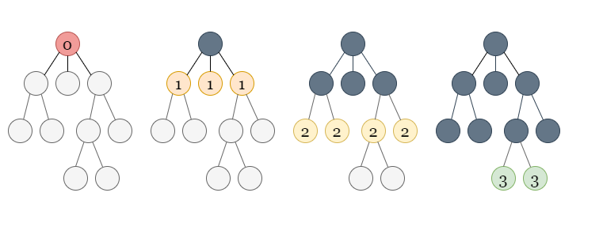

# Solution

---

## Overview

We are given n cities, some of which are connected to other cities given by an n x n matrix isConnected. The connectivity is transitive, which means that if city a is directly connected with city b and city b is directly connected with city c, then city a is indirectly connected with city c.

A province is defined as a group of directly or indirectly connected cities with no other cities outside of the group.

Our task is to return the total number of provinces.

---

## Approach 1: Depth First Search
### Intuition

We can see that two cities x and y belong to the same province if there is a path from city x to city y using the cities that are directly connected.

This leads us to consider the problem in terms of graphs.

Each city can be thought of as a node in a graph. The roads that directly connect the cities are the edges. If there is a path in this graph connecting cities x and y, then x and y are in the same province. Because the graph is undirected, x and y belong to the same province if and only if they are part of the same graph component.

The number of required provinces is the number of connected components formed in such a graph.

To check the number of connected components in a graph, we can use a graph traversal algorithm like depth first search (DFS).

In DFS, we use a recursive function to explore nodes as far as possible along each branch. Upon reaching the end of a branch, we backtrack to the next branch and continue exploring.

Once we encounter an unvisited node, we will take one of its neighbor nodes (if exists) as the next node on this branch. Recursively call the function to take the next node as the 'starting node' and solve the subproblem.


If you are new to Depth First Search, please see our LeetCode Explore Card for more information on it!

To figure out how many connected components there are in the graph, we first mark all nodes as unvisited.

We iterate through all the nodes from 0 to n - 1, checking whether each node has been visited or not. As the graph is undirected, a DFS traversal from node would visit all of the nodes in the component to which node belongs. Whenever we see an unvisited node while looping through all the nodes, it means we have found a new component. We run the DFS traversal from the unvisited node to traverse over all the nodes in the new component, marking all these nodes as visited to avoid counting a component more than once.

The number of connected components in the graph is equal to the number of unvisited nodes we encounter (the number of times we start a DFS traversal) in this process.

### Algorithm

1. Create an integer variable n which stores the number of cities.
2. Create a visit array of length n to keep track of nodes that have been visited.
3. Create an integer numberOfComponents which stores the number of connected components in the graph. Initialize it to 0.
4. Iterate through all of the nodes, and for each node i check if it has been visited or not. If node i is not visited, we increment numberOfComponents by 1 and start a DFS traversal:
    * We use the dfs function to perform the traversal. For each call, pass node, isConnected, and visit as the parameters. We start with node i.
    * We mark node as visited.
    * We iterate over all the values in isConnected[node] to get the neighbors of node. If isConnected[node][i] == 1, one neighbor of node is i (as we have a direct edge between node and i). For each neighbor i that has not yet been visited, we recursively call dfs with i as the node.
5. Return numberOfComponents.

### Implementation

Java

```Java
class Solution {
    public void dfs(int node, int[][] isConnected, boolean[] visit) {
        visit[node] = true;
        for (int i = 0; i < isConnected.length; i++) {
            if (isConnected[node][i] == 1 && !visit[i]) {
                dfs(i, isConnected, visit);
            }
        }
    }

    public int findCircleNum(int[][] isConnected) {
        int n = isConnected.length;
        int numberOfComponents = 0;
        boolean[] visit = new boolean[n];

        for (int i = 0; i < n; i++) {
            if (!visit[i]) {
                numberOfComponents++;
                dfs(i, isConnected, visit);
            }
        }

        return numberOfComponents;
    }
}
```

### Complexity Analysis

Here n is the number of cities.

    Time complexity: O(n2).
        Initializing the visit array takes O(n) time.
        The dfs function visits each node once, which takes O(n) time because there are nnn nodes in total. From each node, we iterate over all possible edges using isConnected[node] which takes O(n) time for each visited node. As a result, it takes a total of O(n2) time to visit all the nodes and iterate over its edges.

    Space complexity: O(n).
        The visit array takes O(n) space.
        The recursion call stack used by dfs can have no more than nnn elements in the worst-case scenario. It would take up O(n) space in that case.

---

## Approach 2: Breadth First Search
### Intuition

As we just have to find the number of connected components in the graph, another method is to use a breadth-first search (BFS).

BFS is an algorithm for traversing or searching a graph. It traverses in a level-wise manner, i.e., all the nodes at the present level (say l) are explored before moving on to the nodes at the next level (l + 1), where a level's number is the distance from a starting node. BFS is implemented with a queue.

Here is an example with the steps:



If you are not familiar with BFS traversal, we suggest you read our LeetCode Explore Card.

### Algorithm

1. Create an integer variable n which stores the number of cities.
2. Create a visit array of length n to keep track of nodes that have been visited.
3. Create an integer numberOfComponents which stores the number of connected components in the graph. Initialize it to 0.
4. Iterate through all of the nodes, and for each node i check if it has been visited or not. If node i is not visited, we increment numberOfComponents by 1 and start a BFS traversal:
    * We use the bfs function to perform the traversal. For each call, pass node, isConnected, and visit as the parameters. We start with node i.
    * We create an integer queue q and push node into it. We also mark node as visited.
    * We now loop until the queue is empty. The queue's first element, node, is popped out. We iterate over all the neighbors of node where the neighboring nodes are found using isConnected[node]. If any neighbor has not yet been visited, we mark it as visited and push it into the queue.
5. Return numberOfComponents.

### Implementation

Java

```Java
class Solution {
    public void bfs(int node, int[][] isConnected, boolean[] visit) {
        Queue<Integer> q = new LinkedList<>();
        q.offer(node);
        visit[node] = true;

        while (!q.isEmpty()) {
            node = q.poll();

            for (int i = 0; i < isConnected.length; i++) {
                if (isConnected[node][i] == 1 && !visit[i]) {
                    q.offer(i);
                    visit[i] = true;
                }
            }
        }
    }

    public int findCircleNum(int[][] isConnected) {
        int n = isConnected.length;
        int numberOfComponents = 0;
        boolean[] visit = new boolean[n];

        for (int i = 0; i < n; i++) {
            if (!visit[i]) {
                numberOfComponents++;
                bfs(i, isConnected, visit);
            }
        }

        return numberOfComponents;
    }
}
```

### Complexity Analysis

Here nnn is the number of cities.

    Time complexity: O(n2).
        Initializing the visit array takes O(n) time.
        Each queue operation in the BFS algorithm takes O(1) time, and a single node can only be pushed once, leading to O(n) operations for nnn nodes. As discussed above, we iterate over all possible edges using isConnected[node] which takes O(n) time for each visited node, resulting in O(n2) operations in total in the worst-case scenario while visiting all nodes.

    Space complexity: O(n).
        The BFS queue takes O(n) because each node is added, and in the worst-case scenario you could have a linear amount of nodes in the queue at once.
        The visit array takes O(n) space as well.

---

## Approach 3: Union-find
### Intuition

Another approach to solving questions based on graph connectivity is the union-find data structure.

A disjoint-set data structure also called a union–find data structure or merge–find set, is a data structure that stores a collection of disjoint (non-overlapping) sets. Equivalently, it stores a partition of a set into disjoint subsets. It provides operations for adding new sets, merging sets (replacing them by their union), and finding a representative member of a set. It implements two useful operations:

1. Find: Determine which subset a particular element is in. This can be used to determine if two elements are in the same subset.
2. Union: Join two subsets into a single subset.

If you are new to Union-Find, we suggest you read our [LeetCode Explore Card](https://leetcode.com/explore/learn/card/graph/618/disjoint-set/3881/). We will not talk about implementation details in this article, but only about the interface to the data structure.

Our task, as with the previous approaches, is to count the number of connected components formed in the graph with cities acting as nodes and an edge between directly connected cities.

We initialize all nodes as separate components in the union-find data structure. We create a variable called numberOfComponents to count the number of connected components in the graph and initialize it to the number to the nodes.

We iterate over all the edges, decrementing numberOfComponents by 1 for each edge whenever two different components are merged into a single one using that edge.

### Algorithm

1. Create an integer variable n which stores the number of cities.
2. Create an instance of UnionFind of size n.
3. Create an integer variable numberOfComponents to count the number of connected components in the graph. We initialize it to n as each node initially behaves as a separate component.
4. We iterate over isConnected using two loops, outer loop running from i = 0 to n - 1 and an inner loop running from j = i + 1 to n - 1. For each pair of directly connected cities i and j, i.e., isConnected[i][j] == 1, we use the find operation to determine which components both of them belong to. If they belong to different components, i.e., find(i)!= find(j), we perform a union operation on both nodes, combining the two different connected components into a single connected component. We also reduce numberOfComponents by one as we just merged two different components. We don't do anything if i and j already belong to the same component.
5. Return numberOfComponents.

### Implementation

Java

```Java
class UnionFind {
    int[] parent;
    int[] rank;
    public UnionFind(int size) {
        parent = new int[size];
        for (int i = 0; i < size; i++)
            parent[i] = i;
        rank = new int[size];
    }
    public int find(int x) {
        if (parent[x] != x)
            parent[x] = find(parent[x]);
        return parent[x];
    }
    public void union_set(int x, int y) {
        int xset = find(x), yset = find(y);
        if (xset == yset) {
            return;
        } else if (rank[xset] < rank[yset]) {
            parent[xset] = yset;
        } else if (rank[xset] > rank[yset]) {
            parent[yset] = xset;
        } else {
            parent[yset] = xset;
            rank[xset]++;
        }
    }
}

class Solution {
    public int findCircleNum(int[][] isConnected) {
        int n = isConnected.length;
        UnionFind dsu = new UnionFind(n);
        int numberOfComponents = n;

        for (int i = 0; i < n; i++) {
            for (int j = i + 1; j < n; j++) {
                if (isConnected[i][j] == 1 && dsu.find(i) != dsu.find(j)) {
                    numberOfComponents--;
                    dsu.union_set(i, j);
                }
            }
        }

        return numberOfComponents;
    }
}
```

### Complexity Analysis

Here n is the number of cities.

    Time complexity: O(n2).
        We need O(n2) time to iterate over all the values in isConnected.
        For T operations, the amortized time complexity of the union-find algorithm (using path compression with union by rank) is O(alpha(T)). Here, α(T) is the inverse Ackermann function that grows so slowly, that it doesn't exceed 4 for all reasonable T (approximately T<10^600). You can read more about the complexity of union-find [here](https://en.wikipedia.org/wiki/Disjoint-set_data_structure#Time_complexity). Because the function grows so slowly, we consider it to be O(1).
        Initializing UnionFind takes O(n) time beacuse we are initializing the parent and rank arrays of size n each.
        We iterate through every edge and use the find operation to find the component of nodes connected by each edge. It takes O(1) per operation and takes O(e) time for all the eee edges. We can have a maximum of O(n^2) edges in between nnn nodes (each node is connected to other), so it would take O(n^2) time. If nodes from different components are connected by an edge, we also perform union of the nodes, which takes O(1) time per operation. In the worst-case scenario, it may be called O(n) times to connect all the components to form a connected graph with only one component.

    Space complexity: O(n).
        We are using the parent and rank arrays, both of which require O(n) space each.
