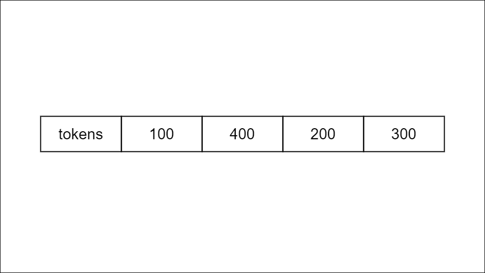
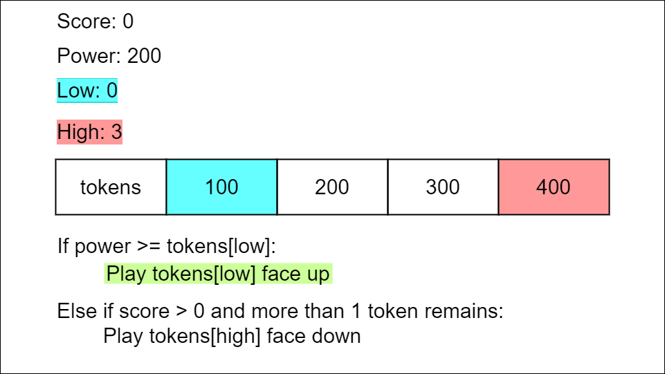
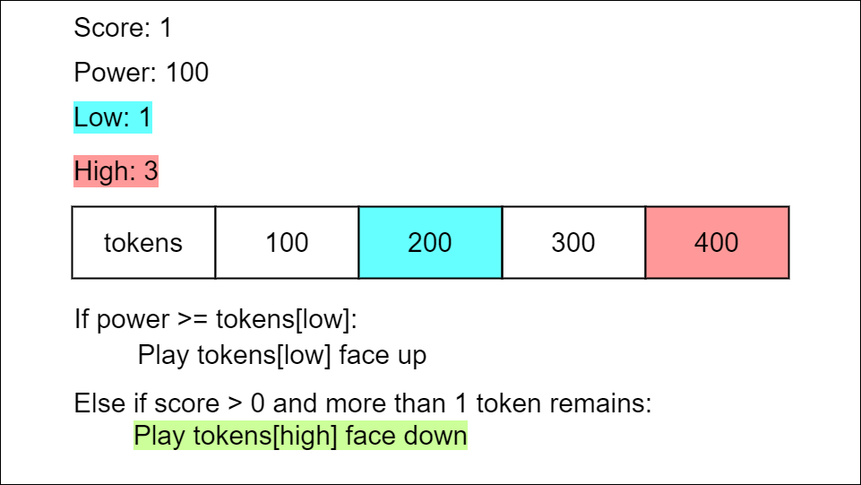
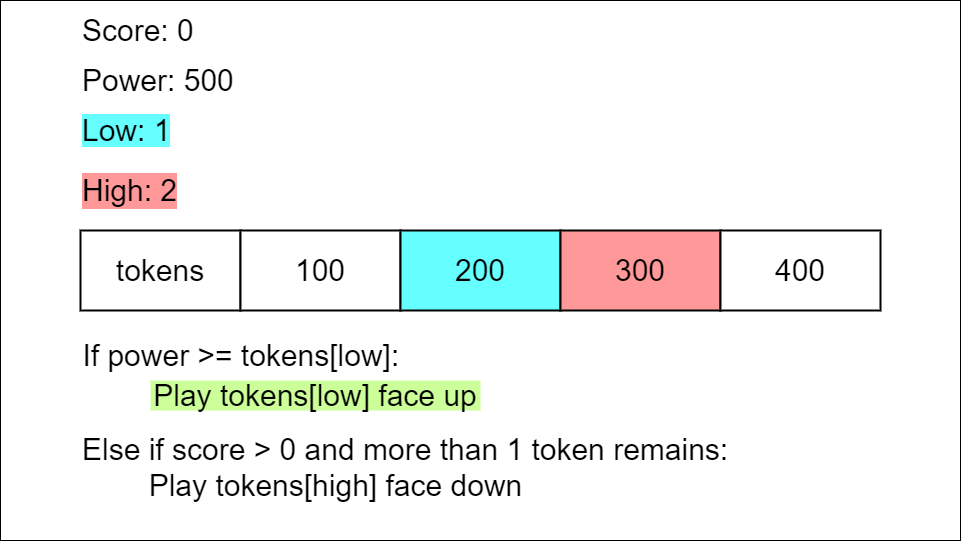
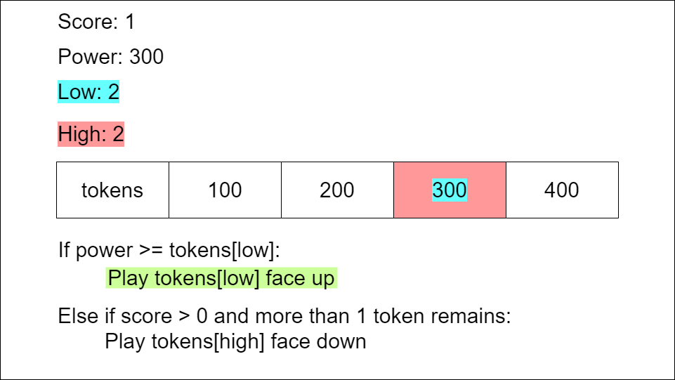
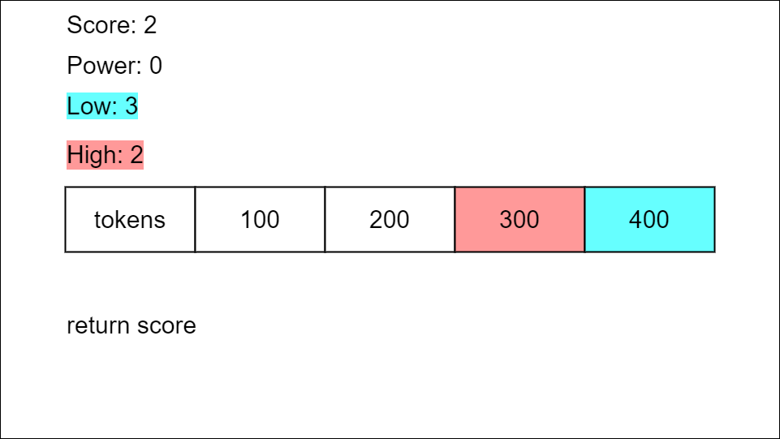

# Solution
## Overview

Our goal is to return the highest score possible. We gain score by placing tokens face-up, which costs power. We gain power by playing tokens face-down, which costs score. We can only play a token face-up when we have enough power, and we can only play a token face-down when we have enough score. Note that the value of each token is positive, and the initial power is also positive.

A crucial insight is that we can play a token face-up to trade any amount tokens[i] for 1 score as long as we have at least that much power. Alternatively, we can play a token face-down to trade 1 score for any amount tokens[i] of power.

## Approach: Sort and Greedy
### Intuition

How do we determine which tokens to play face-up and which to play face-down?

Let's look at some examples:

Example A: (Example 3 from the problem description)

> Input: tokens = [100, 200, 300, 400], power = 200

> Output: 2

Tokens played face-up: token0 (100), token1 (200), token2 (300).

Tokens played face-down: token3 (400).

Example B:

> Input: tokens = [1, 4, 1, 1], power = 1

> Output: 2

Tokens played face-up: token0 (1), token2 (1), token3 (1).

Tokens played face-down: token1 (4).

**What patterns do we notice in how the tokens are played to maximize the score in the above examples?**

* The lowest power tokens are played face-up to increase the score.

* The highest power tokens are played face-down to increase power.

**We can develop a strategy based on these observations:**

* When you have enough power to play face-up, maximize the score by playing the lowest power tokens face-up. This way you are increasing the score without losing a significant amount of power.

* When you do not have enough power to play face-up, maximize power by playing the highest power tokens face-down. This way you trade a relatively small amount of score for a relatively large amount of power.

* We should play the lowest tokens face-up until we do not have enough power, then play token(s) face-down until we can play face-up again.

* We continue while we can either play a token face-up or face-down.

**How can we identify the lowest and highest power tokens?**

We will need to do the above process repeatedly, so we will sort the array from lowest power to highest power.

We can then use two pointers, low and high. low will point to the lowest power token in tokens that hasn't been used, and high will point to the highest power token in tokens that hasn't been used. We can process the tokens in the array, one at a time.

If we have enough power to play the lowest power token face-up, we play it, increase the score and the low pointer, and decrease power accordingly.

When we don't have enough power to play the lowest power token face-up, but we have at least 1 score, we play the highest power token face-down. The exception is if this is our last token remaining. Since we lose a score point every time we play a token face-up, it would not maximize our score to play a token face-down unless there is one to play after it. We increase power accordingly and decrease the score and the high pointer.

If we can't play face-up or down, we return the score.

This playing strategy is visualized below:








**How do we know this method will lead to the highest score?**

Assume the greedy strategy of playing the lowest power tokens face-up, and the highest power token face-down when we can't afford to play any tokens face-up is not optimal. Then, it would be possible to obtain a higher score with a different playing strategy.

Let's discuss Example A with a different playing strategy: Play the highest token we can afford face-up, and the lowest token face-down.

Input: tokens = [100, 200, 300, 400], power = 200

Move 1: Play token1 (200) face-up, reducing power to 0 and increasing score to 1.

Move 2: Play token0 (100) face-down, increasing power to 100 and reducing score to 0.

Output: 0

After these two moves, have neither enough score nor enough power to play either of the remaining tokens, token2 (300), and token3 (400), face-up or face-down. The greedy approach of playing the highest power tokens face-down and the lowest power tokens face-up is more effective because for each token played, the amount of score gained or lost is always 1, but we minimize the power spent to gain score and the score spent to gain power. Therefore, the way to obtain the highest score is to play the lowest power tokens face-up.

### Algorithm

1. Initializations:
    * Initialize a pointer low to 0 and high to tokens.length - 1. low points to the first index of tokens and high points the the last index of tokens.
    * Initialize a variable score to 0.
2. Sort tokens in ascending order.
3. While low is less than or equal to high:
    * If power is greater than or equal to tokens[low], we have enough power to play a token face-up. We increment score by 1, reduce power by tokens[low], and increase low by 1.
    * Else if score is greater than 0, and low is less than high, we play a token face-down. We decrease score by 1, increase our power by tokens[high], and decrease high by 1.
    * Otherwise, we don't have enough power to play a token face-up, and we either don't have enough score to play a token face-down or not enough tokens remain to make it worth playing a token face-down, so we return score.
4. We have played all the tokens, so we return score.

## Implementation

### Implementation 1: Two Pointer

Java

```Java
public class Solution {
    public int bagOfTokensScore(int[] tokens, int power) {
        int low = 0;
        int high = tokens.length - 1;
        int score = 0;
        Arrays.sort(tokens);

        while (low <= high) {
            // When we have enough power, play lowest token face-up
            if (power >= tokens[low]) {
                score += 1;
                power -= tokens[low];
                low += 1;
            // We don't have enough power to play a token face-up
            // If there is at least one token remaining,
            // and we have enough score, play highest token face-down
            } else if (low < high && score > 0) {
                score -= 1;
                power += tokens[high];
                high -= 1;
            // We don't have enough score, power, or tokens 
            // to play face-up or down and increase our score
            } else {
                return score;
            }
        }
        return score;
    }
}
```

### Implementation 2: Deque

Like in the previous implementation, we will sort the array to facilitate the identification of the lowest and highest power tokens.

Instead of using two pointers, we store the values of tokens in a deque, a double-ended queue where values can be accessed from both ends. We can pop the rear (leftmost) token to access the lowest power token and pop the front (rightmost) token to access the highest power token.

The rest of the gameplay proceeds similarly to the above approach. When we play the lowest remaining token, we pop the leftmost value from the deque, and when we play the highest remaining token, we pop the rightmost token.

Java

```Java
public class Solution {
    public int bagOfTokensScore(int[] tokens, int power) {
        int score = 0;
        Arrays.sort(tokens);
        Deque<Integer> deque = new LinkedList<>();

        for (int token : tokens) {
            deque.add(token);
        }

        while (!deque.isEmpty()) {
            // When we have enough power, play token face-up
            if (power >= deque.peekFirst()) {
                power -= deque.pollFirst();
                score++;
            // We don't have enough power to play a token face-up
            // When there is at least one token remaining,
            // and we have enough score, play token face-down
            } else if (deque.size() > 1 && score > 0) {
                power += deque.pollLast();
                score--;
            // We don't have enough score, power, or tokens 
            // to play face-up or down and increase our score
            } else {
                return score;
            }
        }
        return score;
    }
}
```

The time complexity of the deque implementation is the same as the two-pointer implementation. The deque, deque contains all of the elements of tokens so it uses nnn space. The space complexity of this implementation is O(n).

### Complexity Analysis

Let n be the length of tokens.

* Time complexity: O(n * log⁡ n)

Sorting tokens takes O(n * log ⁡n).

We process tokens using the pointers low and high until they meet in the middle or we can't play any more tokens. With each iteration, low is incremented, or high is decremented, or the loop terminates because we can't make any more moves that increase our score. We handle each token in tokens at most once, so the time complexity is O(n).

`O(n * log ⁡n)` is the dominating term.

* Space complexity: O(n) or O(log⁡ n)

Sorting uses extra space, which depends on the implementation of each programming language.
- In Python, the sort method sorts a list using the Timsort algorithm which is a combination of Merge Sort and Insertion Sort and has O(n) additional space.
- In Java, Arrays.sort() is implemented using a variant of the Quick Sort algorithm which has a space complexity of O(log⁡ n) for sorting an array.
- In C++, the sort() function is implemented as a hybrid of Quick Sort, Heap Sort, and Insertion Sort, with a worse-case space complexity of O(log⁡ n).

Other than sorting, we use a handful of variables that use constant, O(1) space, so the space used for sorting is the dominant term.
